# PRD: Cloud Synchronization

## Overview

Cloud synchronization enables multi-device usage (phone, watch, Pi kiosk dashboard) while maintaining Kairos's offline-first architecture. The system uses **Firebase**:

- **Firebase Auth** — Email/password and OAuth authentication
- **Cloud Firestore** — Real-time document database with built-in offline persistence
- **Firebase Admin SDK** — Server-side access for the Pi kiosk dashboard

ESP32 presence detection routes through **Home Assistant's built-in MQTT broker** — no standalone messaging infrastructure needed.

---

## Problem Statement

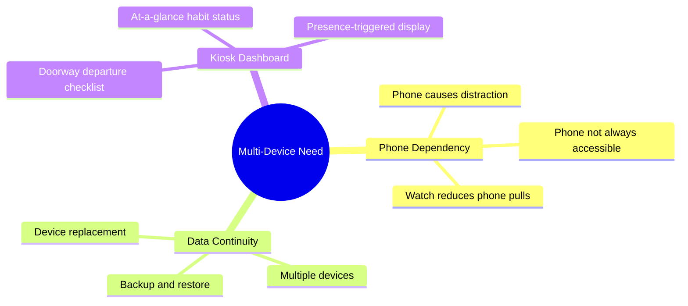

### Design Constraints

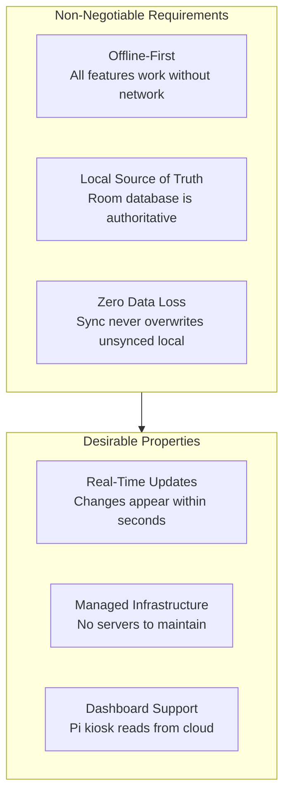

---

## Goals

### Primary Goals (P0)

| Goal                                     | Success Criteria                   |
| ---------------------------------------- | ---------------------------------- |
| Offline-first architecture uncompromised | 100% feature parity offline        |
| No data loss during sync                 | Zero local changes lost            |
| Multi-device sync (phone + watch)        | Changes propagate within 5 seconds |
| Managed infrastructure                   | Zero servers to maintain           |

### Secondary Goals (P1)

| Goal                               | Success Criteria                          |
| ---------------------------------- | ----------------------------------------- |
| Pi kiosk dashboard reads live data | Firestore listener updates within seconds |
| Transparent conflict handling      | Last-write-wins automatic resolution      |
| Sync status always visible         | Clear indicator in UI                     |
| Multi-user support                 | Separate Firebase Auth accounts           |

### Tertiary Goals (P2)

| Goal                       | Success Criteria                   |
| -------------------------- | ---------------------------------- |
| Dashboard touch completion | Write-back to Firestore from Pi    |
| Shared habits (v1.1)       | Household members share habits     |
| Presence-triggered display | ESP32 → HA → dashboard mode switch |

---

## Architecture Overview

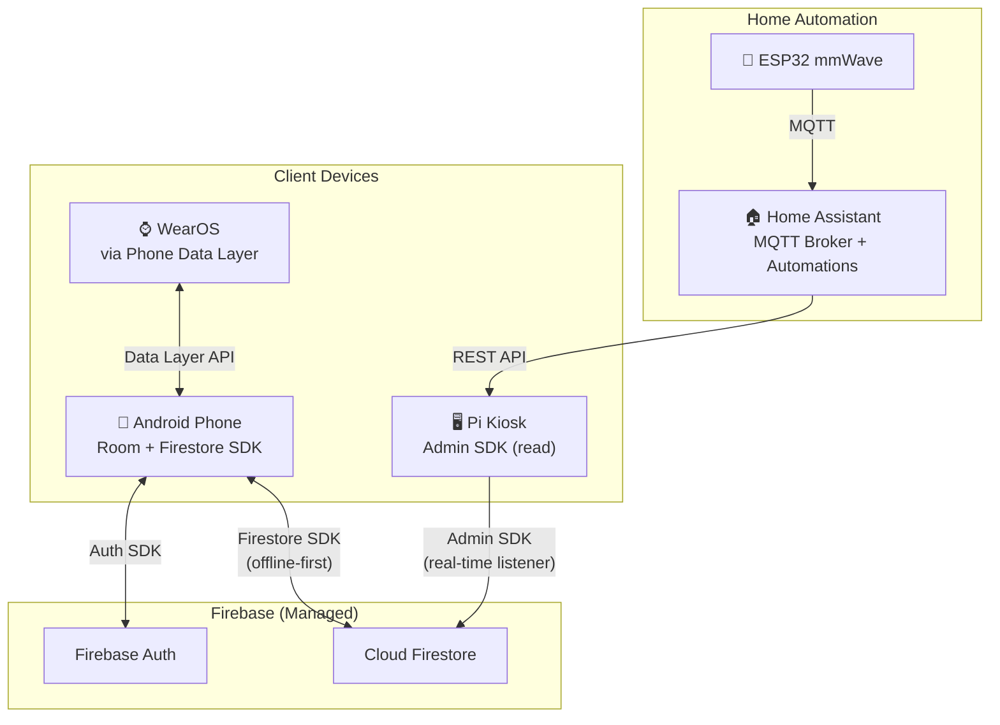

### Component Responsibilities

| Component              | Purpose                                 | Technology             |
| ---------------------- | --------------------------------------- | ---------------------- |
| **Firebase Auth**      | User identity, email/password + OAuth   | Managed service        |
| **Cloud Firestore**    | Real-time document DB, offline cache    | Managed service        |
| **Firebase Admin SDK** | Privileged read access for Pi dashboard | JVM library            |
| **Home Assistant**     | MQTT broker, presence automations       | Self-hosted (existing) |

---

## Why Firebase

| Requirement           | Firebase Solution                                                     |
| --------------------- | --------------------------------------------------------------------- |
| Offline-first (P0)    | Firestore has built-in offline persistence — enable with one line     |
| Zero data loss (P0)   | Firestore SDK queues writes offline, syncs automatically on reconnect |
| Real-time updates     | Snapshot listeners push changes to all connected clients              |
| No server maintenance | Fully managed — no Docker, no Postgres, no infra to monitor           |
| Pi dashboard access   | Admin SDK (JVM) provides privileged read/write from Kotlin Desktop    |
| Multi-user isolation  | Firestore security rules enforce per-user data access                 |
| Cost                  | Free tier handles personal/household usage with wide margin           |

### What Firebase Doesn't Do

| Limitation                 | Mitigation                                                      |
| -------------------------- | --------------------------------------------------------------- |
| No SQL JOINs               | Room handles JOINs locally; Firestore is flat document storage  |
| No unique constraints      | Application-level validation (one completion per habit per day) |
| No foreign key enforcement | Application-level referential integrity                         |
| Vendor lock-in             | Room as local source of truth means data is always on-device    |
| No MQTT broker             | Home Assistant provides MQTT for ESP32 presence detection       |

---

## Authentication Flow

Firebase Auth handles all authentication. Firestore security rules validate the authenticated user.

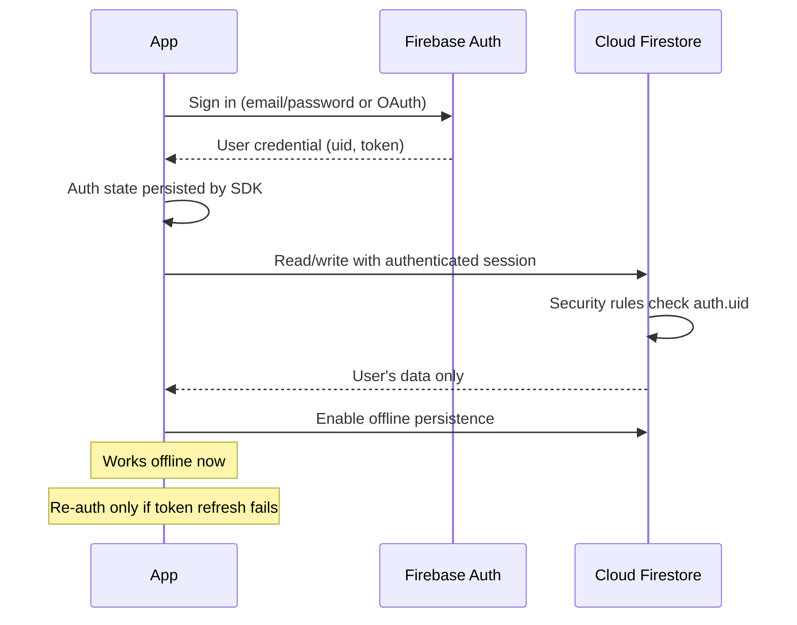

### Token Strategy

| Token         | Lifetime | Purpose                             |
| ------------- | -------- | ----------------------------------- |
| ID Token      | 1 hour   | Auto-refreshed by SDK transparently |
| Refresh Token | ~1 year  | Long-lived, persisted by SDK        |

**Offline behavior**: App works fully offline using Firestore's local cache plus Room. Tokens only matter when syncing. Firebase SDK handles token refresh transparently — the app never manages tokens directly.

---

## Sync Architecture

### Data Flow: Room ↔ Firestore

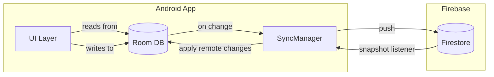

### How Sync Works

1. **All reads come from Room** — UI never queries Firestore directly
2. **All writes go to Room first** — then SyncManager pushes to Firestore asynchronously
3. **Firestore snapshot listeners** detect remote changes and write them to Room
4. **Firestore offline cache** provides a bonus safety layer — writes queue locally if offline
5. **Conflict resolution** is last-write-wins based on `updatedAt` timestamp

### Why Room Stays as Source of Truth

Room is not replaced by Firestore's offline cache because:

- Room supports JOINs (e.g., today's habits + their completions in one query)
- Room is accessible to WorkManager workers (lapse detection, fresh start checks)
- Room data survives Firebase SDK updates and cache clears
- Firestore's offline cache is opaque — no SQL queries against it

Firestore's offline persistence is still enabled as a bonus layer, but the app never reads from it directly.

### Conditional Firebase Initialization

Sync features are only available after Firebase has been configured and initialized. The `SyncManager`, `FirestoreDataSource`, and `AuthManager` are provided by Koin modules that load conditionally (see Architecture doc, "Phased Koin Initialization"):

- **Sync not available**: When Firebase is not yet configured (new self-hoster on first launch), only Room-backed local operations are functional. The app operates in local-only mode with no sync, no snapshot listeners, and no auth. The `syncModule`, `dataModule`, and `authModule` are not instantiated.
- **Sync available**: Once Firebase is initialized (either auto-init, stored config, or fresh setup), the full module graph loads. Snapshot listeners start, offline queue flushes, and sync operates identically regardless of which initialization path was used.
- **Room always works**: Room database operations (habit CRUD, completions, routines, lapse detection, fresh start checks) function regardless of Firebase state. Local data is never gated behind Firebase configuration.

---

## Use Cases

### UC-1: First-Time Sign-In

**Actor**: New user
**Precondition**: App installed, internet available
**Trigger**: User taps "Sign In" on welcome screen

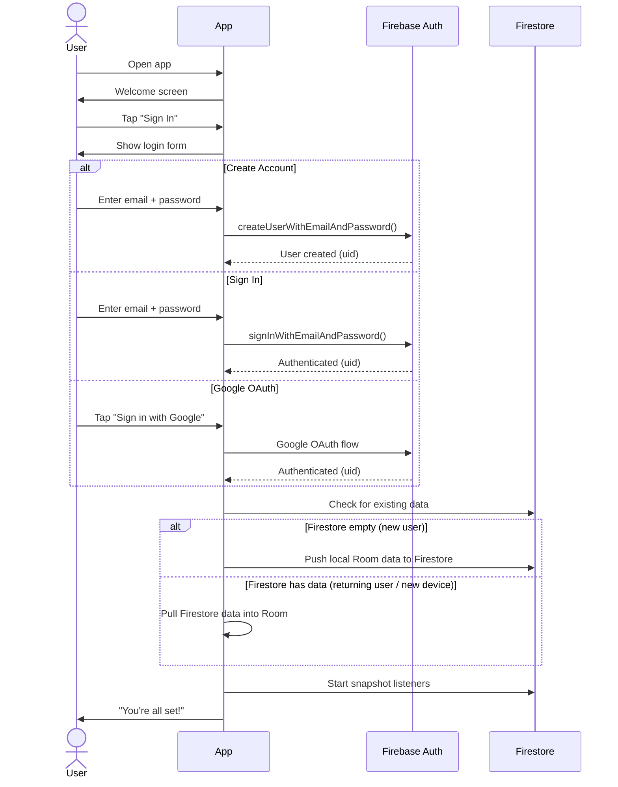

### UC-2: Offline Usage

**Actor**: User without network
**Precondition**: Previously signed in
**Trigger**: User completes habit while offline

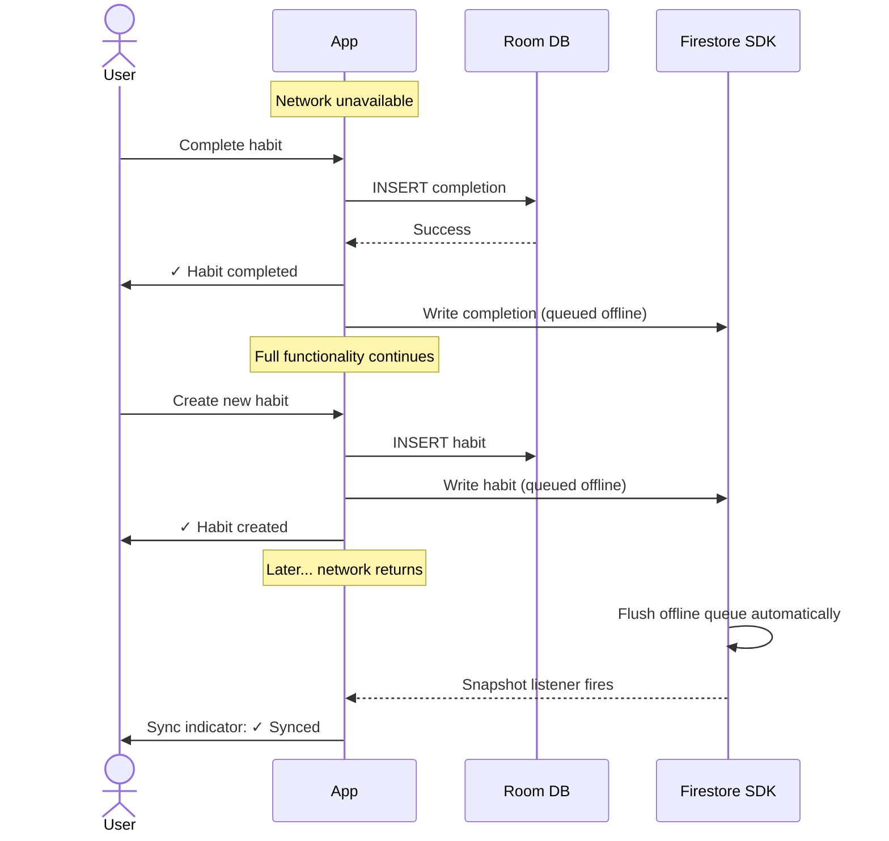

### UC-3: Multi-Device Sync

**Actor**: User with phone and watch
**Precondition**: Both devices authenticated (watch via phone)
**Trigger**: Complete habit on watch

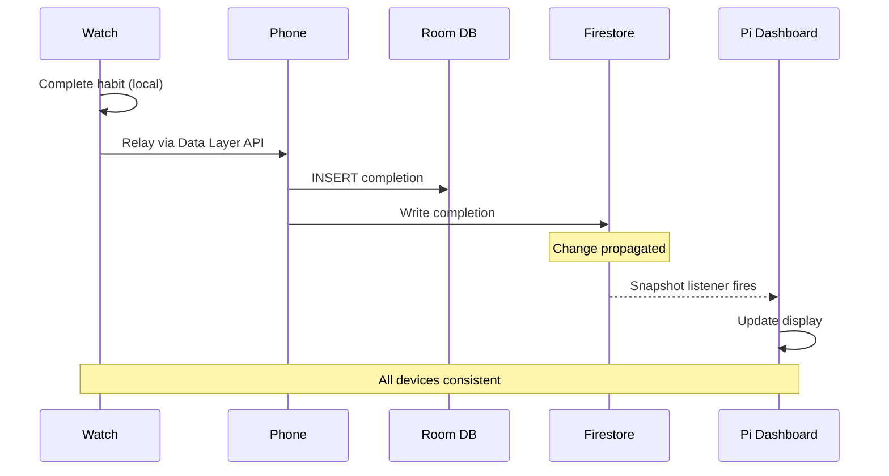

### UC-4: Pi Dashboard Reads Data

**Actor**: Pi kiosk dashboard
**Precondition**: Firebase Admin SDK configured with service account
**Trigger**: Dashboard starts or Firestore data changes

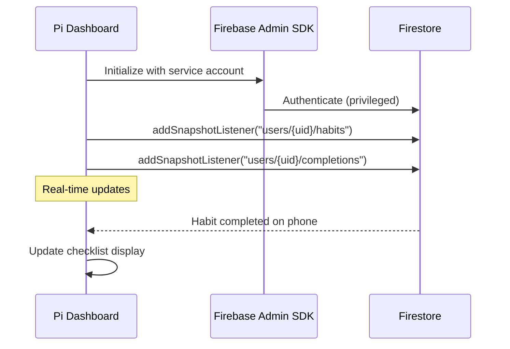

---

## Functional Requirements

### FR-1: Authentication

| ID     | Requirement                                                  | Priority |
| ------ | ------------------------------------------------------------ | -------- |
| FR-1.1 | Email/password authentication via Firebase Auth              | P0       |
| FR-1.2 | Google OAuth support                                         | P1       |
| FR-1.3 | Token management handled by Firebase SDK (automatic)         | P0       |
| FR-1.4 | Sign out (clears auth state, option to keep local data)      | P0       |
| FR-1.5 | Account deletion (deletes Firestore data + Firebase account) | P1       |
| FR-1.6 | Password reset via Firebase email flow                       | P0       |
| FR-1.7 | Auth state persists across app restarts                      | P0       |

### FR-2: Sync Operations

| ID     | Requirement                                                                                                              | Priority |
| ------ | ------------------------------------------------------------------------------------------------------------------------ | -------- |
| FR-2.1 | Room database is local source of truth                                                                                   | P0       |
| FR-2.2 | Local writes to Room trigger Firestore push                                                                              | P0       |
| FR-2.3 | Firestore snapshot listeners update Room on remote changes                                                               | P0       |
| FR-2.4 | Firestore offline persistence enabled as bonus layer                                                                     | P0       |
| FR-2.5 | Sync works after extended offline (Firestore queues writes)                                                              | P0       |
| FR-2.6 | Conflict resolution: last-write-wins by updatedAt                                                                        | P0       |
| FR-2.7 | Manual sync trigger available (pull to refresh)                                                                          | P1       |
| FR-2.8 | All entity types sync: habits, completions, routines, routine_habits, routine_executions, recovery_sessions, preferences | P0       |

### FR-3: Multi-User

| ID     | Requirement                                      | Priority |
| ------ | ------------------------------------------------ | -------- |
| FR-3.1 | User data isolation via Firestore security rules | P0       |
| FR-3.2 | Multiple Firebase Auth accounts supported        | P0       |
| FR-3.3 | Household sharing (v1.1)                         | P2       |

### FR-4: Dashboard Access

| ID     | Requirement                                    | Priority |
| ------ | ---------------------------------------------- | -------- |
| FR-4.1 | Pi dashboard reads via Firebase Admin SDK      | P1       |
| FR-4.2 | Service account key stored on Pi filesystem    | P1       |
| FR-4.3 | Real-time snapshot listeners for live updates  | P1       |
| FR-4.4 | Dashboard write-back for touch completion (v2) | P2       |

---

## Non-Functional Requirements

### Performance

| ID     | Requirement                       | Target       |
| ------ | --------------------------------- | ------------ |
| NFR-P1 | Local write latency (Room)        | < 50ms       |
| NFR-P2 | Firestore push latency (online)   | < 2 seconds  |
| NFR-P3 | Snapshot listener update delivery | < 5 seconds  |
| NFR-P4 | Sync after extended offline       | < 30 seconds |

### Reliability

| ID     | Requirement               | Target                    |
| ------ | ------------------------- | ------------------------- |
| NFR-R1 | Data loss during sync     | Zero                      |
| NFR-R2 | Offline feature parity    | 100%                      |
| NFR-R3 | Sync recovery after crash | Automatic (Firestore SDK) |

### Security

| ID     | Requirement          | Target                                       |
| ------ | -------------------- | -------------------------------------------- |
| NFR-S1 | Transport encryption | TLS (Firebase default)                       |
| NFR-S2 | Token management     | Firebase SDK (automatic)                     |
| NFR-S3 | Data isolation       | Firestore security rules by auth.uid         |
| NFR-S4 | No PII in logs       | Enforced                                     |
| NFR-S5 | Pi dashboard auth    | Service account key (privileged, local file) |

---

## Firestore Collection Structure

See `08-erd.md` §Remote Schema (Firestore) for the complete collection structure and document schemas.

```
users/{userId}
users/{userId}/habits/{habitId}
users/{userId}/completions/{completionId}
users/{userId}/routines/{routineId}
users/{userId}/routines/{routineId}/habits/{id}
users/{userId}/routines/{routineId}/variants/{id}
users/{userId}/routine_executions/{id}
users/{userId}/recovery_sessions/{id}
users/{userId}/preferences/{id}
users/{userId}/deletions/{id}
```

### Security Rules

```javascript
rules_version = '2';
service cloud.firestore {
  match /databases/{database}/documents {
    match /users/{userId} {
      allow read, write: if request.auth != null && request.auth.uid == userId;
      match /{document=**} {
        allow read, write: if request.auth != null && request.auth.uid == userId;
      }
    }
  }
}
```

---

## Cost Projection

At personal/household scale, Kairos stays well within Firebase's free tier (Spark plan):

| Resource          | Free Tier       | Kairos Est. Usage                                    |
| ----------------- | --------------- | ---------------------------------------------------- |
| Firestore reads   | 50K/day         | ~500/day (habits + completions + dashboard listener) |
| Firestore writes  | 20K/day         | ~50/day (completions, habit edits)                   |
| Firestore storage | 1 GB            | < 10 MB (text data only)                             |
| Auth              | 10K users/month | 1-2 users                                            |

No paid plan required for personal use.

---

## UI Requirements

### Sync Status Indicator

| State         | Icon | Text         | Notes                                   |
| ------------- | ---- | ------------ | --------------------------------------- |
| Synced        | 🟢   | "Synced"     | All changes uploaded                    |
| Syncing       | 🔄   | "Syncing..." | Transfer in progress                    |
| Offline       | 🟡   | "Offline"    | Working locally, will sync on reconnect |
| Error         | 🔴   | "Sync error" | Tap for details                         |
| Not signed in | ⚫   | "Not synced" | No Firebase account linked              |

### Settings Screen

```
┌─────────────────────────────────────┐
│  Sync & Account                     │
├─────────────────────────────────────┤
│                                     │
│  Status: ✓ Synced                   │
│  Last sync: 2 minutes ago           │
│                                     │
│  Account: you@email.com             │
│                                     │
│  ─────────────────────────────────  │
│                                     │
│  [Sign Out]                         │
│  [Delete Account]                   │
│                                     │
└─────────────────────────────────────┘
```

---

## Error Handling

| Error           | User Message                              | Recovery                     |
| --------------- | ----------------------------------------- | ---------------------------- |
| No internet     | "Working offline. Changes saved locally." | Auto-sync on reconnect       |
| Auth expired    | "Please sign in again."                   | Login screen                 |
| Sync conflict   | (Silent, last-write-wins)                 | Automatic                    |
| Firestore error | "Sync temporarily unavailable."           | Auto-retry                   |
| Quota exceeded  | "Sync paused. Try again later."           | Auto-retry (unlikely to hit) |

---

## Migration Path

### From Local-Only to Synced

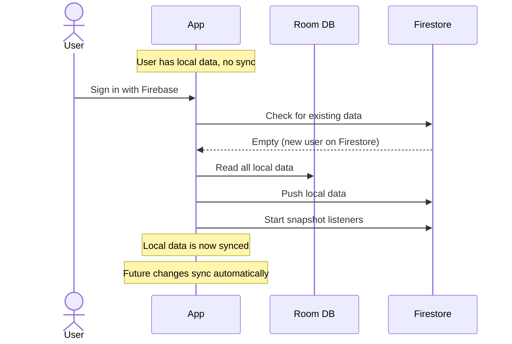

### New Device Setup

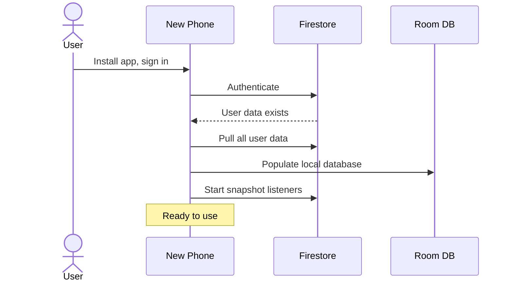

---

## Security Considerations

### Data Isolation

```javascript
// Firestore security rules enforce per-user access
// Each user's data lives under users/{userId}/
// Security rules verify request.auth.uid == userId
// No user can read or write another user's data
```

### Pi Dashboard Security

| Concern                         | Mitigation                                                             |
| ------------------------------- | ---------------------------------------------------------------------- |
| Service account has full access | Key stored only on Pi, never committed to source control               |
| Pi on home network              | Firewall restricts Pi to local network + Firebase APIs                 |
| No user auth on dashboard       | Dashboard is a personal device in your home — admin access appropriate |

### Network Security

| Layer          | Protection                             |
| -------------- | -------------------------------------- |
| Transport      | TLS enforced by Firebase               |
| Authentication | Firebase Auth (ID tokens + refresh)    |
| Authorization  | Firestore security rules               |
| Client storage | Firebase SDK manages token persistence |

---

## Self-Hosting Requirements

Kairos supports self-hosting: users can build the app from source (or install a pre-built APK from GitHub Releases) and connect it to their own Firebase project. This section documents what self-hosters need to set up.

### Firebase Project Setup

Self-hosters must create a Firebase project with the following services enabled:

| Service         | Required configuration                                                    |
| --------------- | ------------------------------------------------------------------------- |
| Firebase Auth   | Enable at least one sign-in provider (email/password recommended)         |
| Cloud Firestore | Create a database (production mode). Deploy security rules from the repo. |

### First-Launch Configuration

On first launch, the app presents a Firebase Setup Screen (see User Flows doc, "Firebase Setup Screen"). The self-hoster must:

1. Open their Firebase Console and navigate to Project Settings > General.
2. Download the `google-services.json` file for their Android app.
3. Paste the full JSON contents into the setup screen's text field.
4. Tap "Configure" to validate, save, and initialize.

Credentials are encrypted at rest using EncryptedSharedPreferences (AES256) and persist across app restarts.

### Firestore Security Rules

Self-hosters **must** deploy `firestore.rules` (located in the repository root) to their Firebase project. Without these rules, Firestore defaults to denying all access, and sync will not function.

```bash
firebase deploy --only firestore:rules
```

### Post-Setup Behavior

After initial configuration, sync works identically to the build-time path (CI builds with `google-services.json`). Snapshot listeners start, offline queue flushes, and multi-device sync operates as documented in the Sync Architecture section above. There is no functional difference between the two initialization paths once Firebase is running.

---

## Future Considerations

### v1.1: Shared Habits

- Firebase Auth supports multiple users natively
- Firestore security rules can be extended for household sharing
- Shared collections under `households/{id}/` with membership checks

### v1.x: Additional Features

- End-to-end encryption (encrypt before writing to Firestore)
- Selective sync (recent data only for watch)
- Firebase Cloud Messaging for cross-device notifications
- Backup/export to local file
