# System Architecture

## Overview

Kairos follows a **Clean Architecture** pattern with clear separation between layers. The system is designed for offline-first operation with Firebase cloud synchronization.

---

## High-Level Architecture

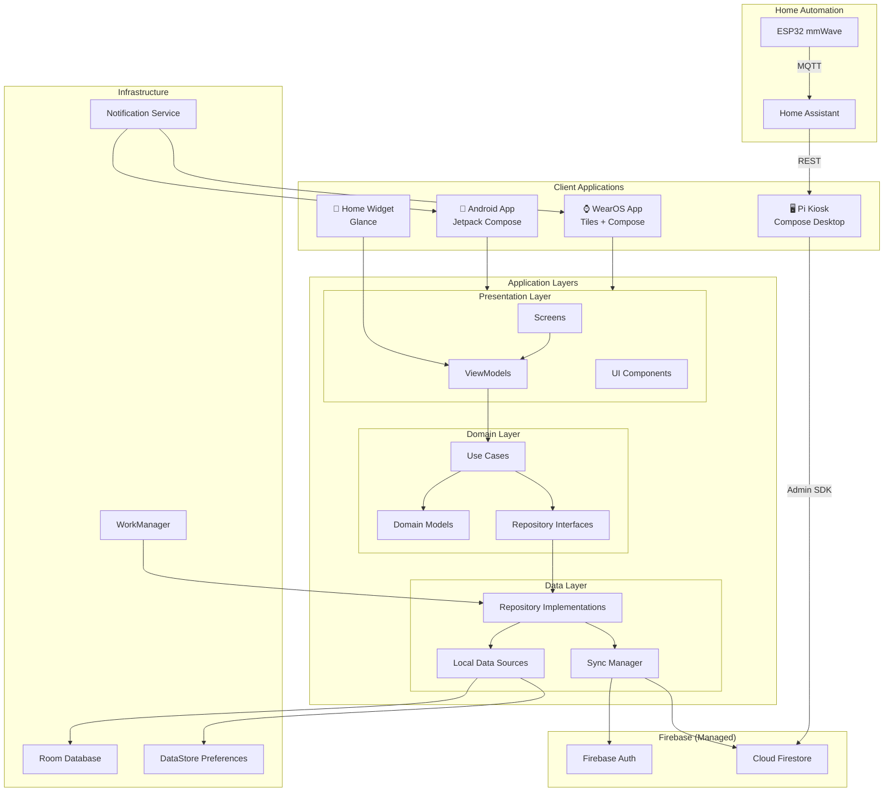

---

## Layer Responsibilities

### Presentation Layer

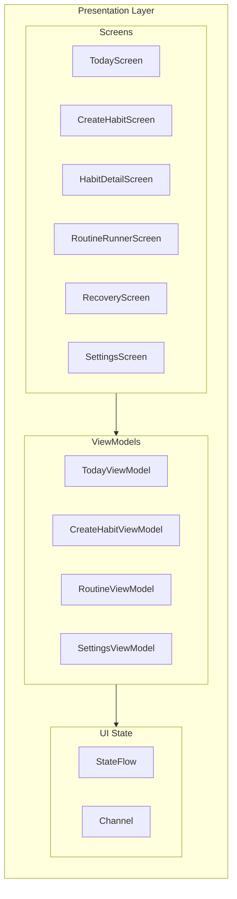

| Component  | Responsibility                             |
| ---------- | ------------------------------------------ |
| Screens    | Compose UI, observes ViewModel state       |
| ViewModels | Manages UI state, invokes use cases        |
| UI State   | Immutable state objects, one-way data flow |
| UI Events  | One-time events (navigation, toasts)       |

### Domain Layer

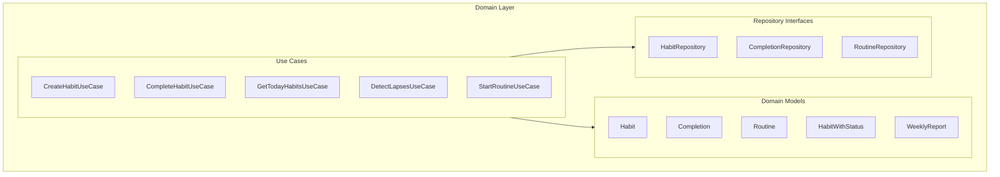

| Component             | Responsibility                                       |
| --------------------- | ---------------------------------------------------- |
| Use Cases             | Single business operation, orchestrates repositories |
| Domain Models         | Pure business entities, no framework dependencies    |
| Repository Interfaces | Contracts for data access                            |

### Data Layer

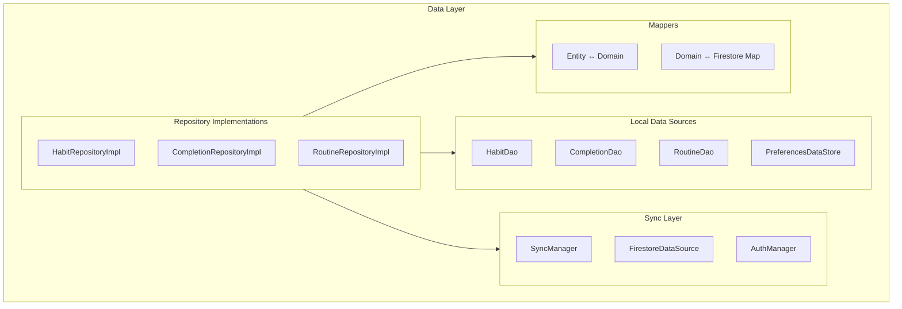

| Component           | Responsibility                                                                                                                                                                    |
| ------------------- | --------------------------------------------------------------------------------------------------------------------------------------------------------------------------------- |
| Repositories        | Read from Room, write to Room, trigger sync                                                                                                                                       |
| DAOs                | Room database access objects                                                                                                                                                      |
| SyncManager         | Push local changes to Firestore, apply remote changes to Room                                                                                                                     |
| FirestoreDataSource | Firestore SDK wrapper (snapshot listeners, writes)                                                                                                                                |
| AuthManager         | Firebase Auth state, sign in/out                                                                                                                                                  |
| FirebaseConfigStore | Persists Firebase project credentials in EncryptedSharedPreferences (AES256). Used by self-hosters who provide credentials at runtime instead of bundling `google-services.json`. |
| FirebaseInitializer | Handles manual `FirebaseApp.initializeApp()` when the google-services plugin is not present. Reads stored config from `FirebaseConfigStore`.                                      |
| Mappers             | Transform between Room entities, domain models, and Firestore documents                                                                                                           |

---

## Module Structure

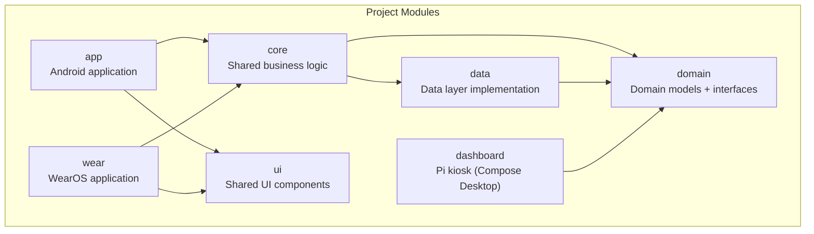

### Module Descriptions

| Module      | Contents                                                                                           | Dependencies       |
| ----------- | -------------------------------------------------------------------------------------------------- | ------------------ |
| `app`       | Android app, DI setup (Koin modules including `firebaseModule` and `setupModule`), navigation      | core, ui           |
| `wear`      | WearOS app, tiles, complications                                                                   | core, ui           |
| `dashboard` | Pi kiosk Compose Desktop app, Admin SDK                                                            | domain             |
| `core`      | Use cases, ViewModels                                                                              | data, domain       |
| `data`      | Repositories, DAOs, entities, SyncManager, Firestore, `FirebaseConfigStore`, `FirebaseInitializer` | domain             |
| `domain`    | Domain models, interfaces                                                                          | None (pure Kotlin) |
| `ui`        | Shared Compose components, theme                                                                   | None               |

---

## Data Flow

### Habit Completion Flow

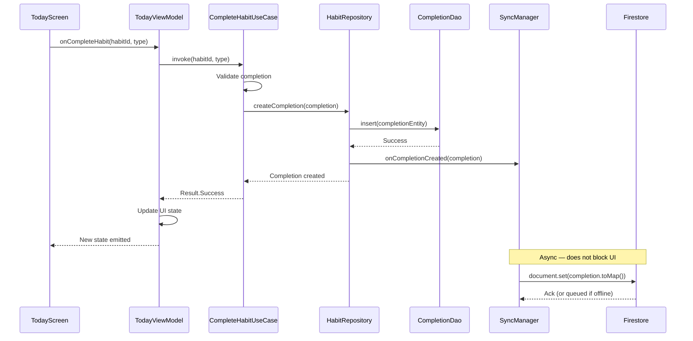

### Sync Data Flow

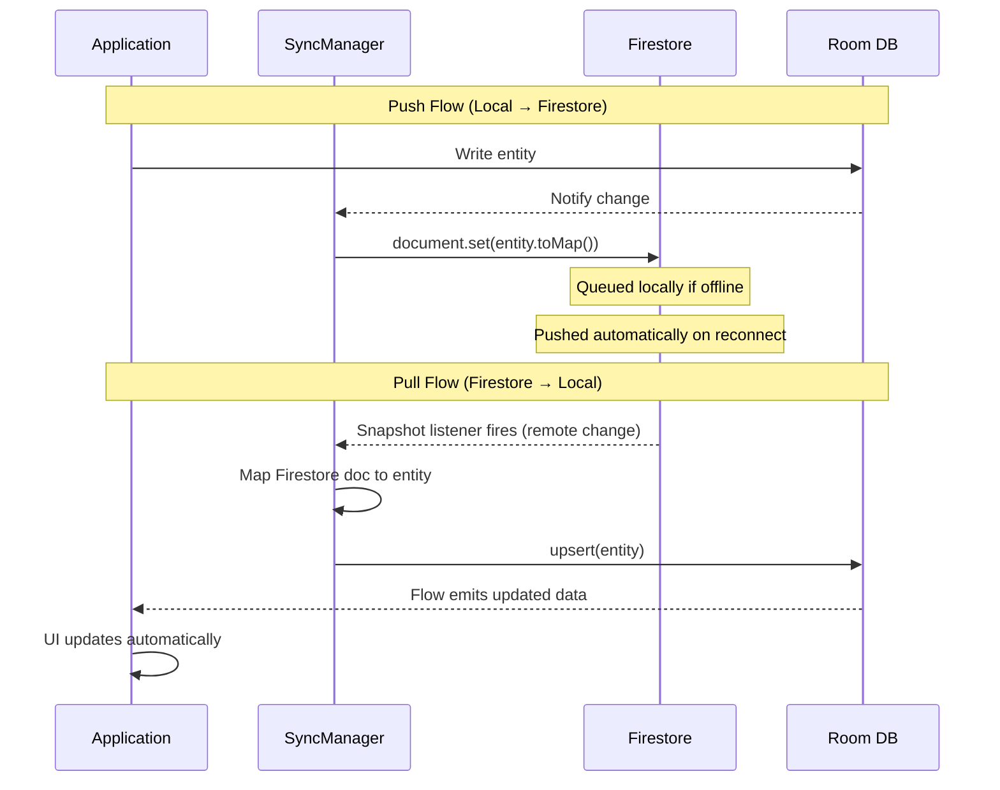

### Routine Execution Flow

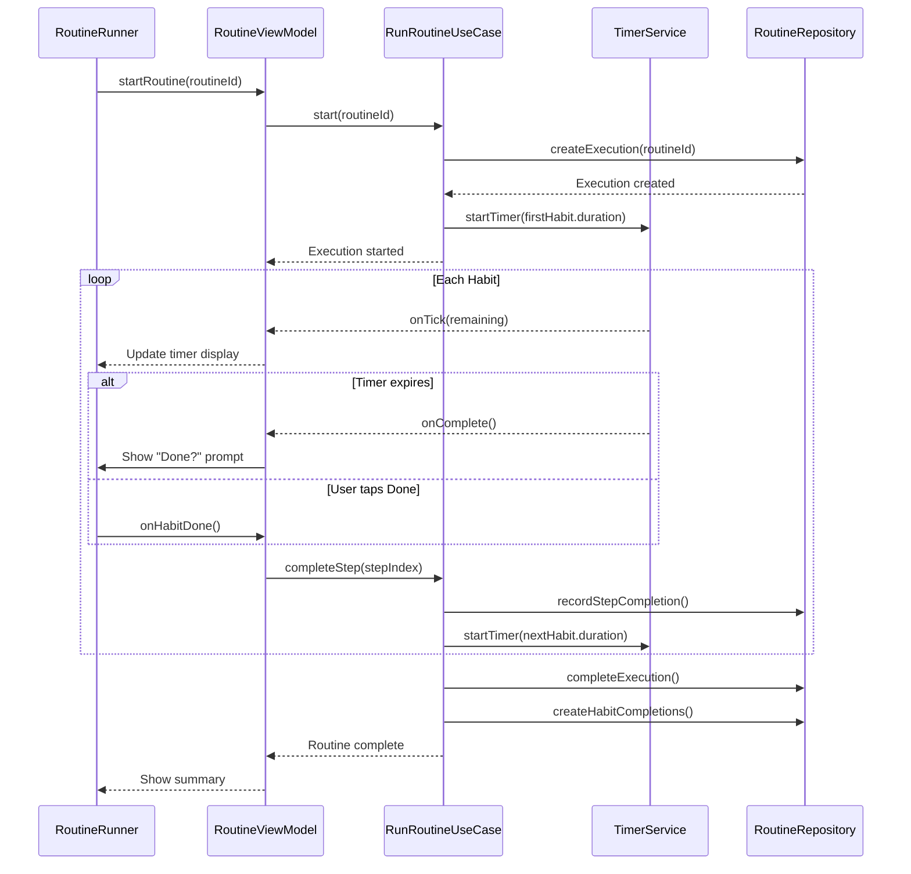

---

## Background Processing

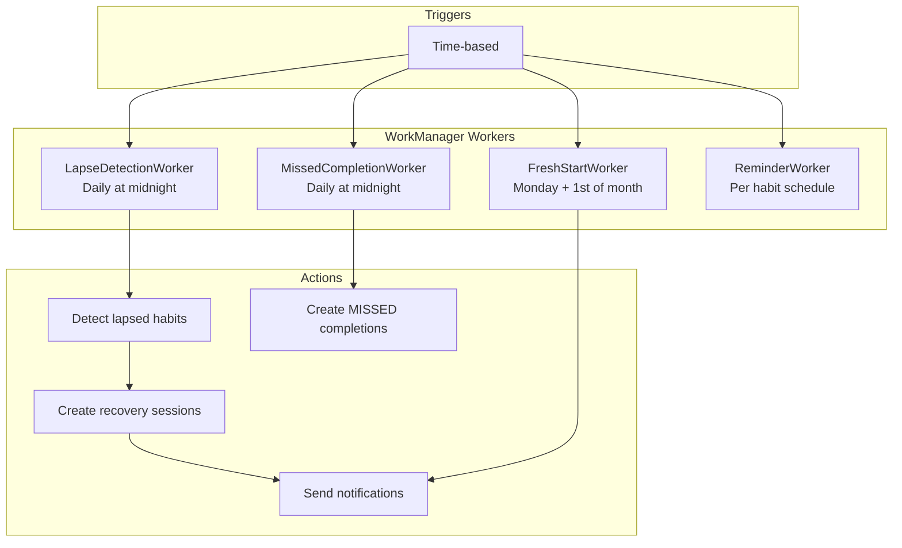

### Worker Schedule

| Worker                 | Schedule                         | Constraints     |
| ---------------------- | -------------------------------- | --------------- |
| MissedCompletionWorker | Daily, midnight                  | None            |
| LapseDetectionWorker   | Daily, 00:00-06:00               | Battery not low |
| FreshStartWorker       | Monday 06:00, 1st of month 06:00 | None            |
| ReminderWorker         | Per-habit schedule               | None            |

> **Note:** There is no SyncWorker. Firestore SDK handles sync automatically via snapshot listeners and its built-in offline queue. No periodic push/pull needed.

---

## Notification Architecture

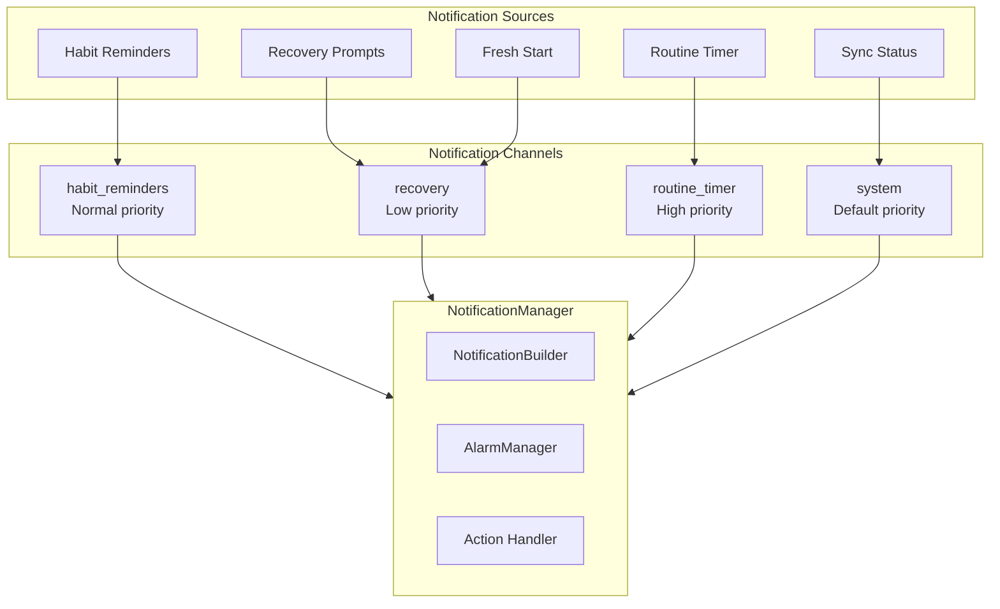

### Notification Actions

| Notification Type | Actions                |
| ----------------- | ---------------------- |
| Habit Reminder    | Complete, Snooze, Skip |
| Recovery Prompt   | Open Recovery, Dismiss |
| Fresh Start       | View Habits, Dismiss   |
| Routine Timer     | Done, Skip, Pause      |

---

## WearOS Architecture

```mermaid
flowchart TB
    subgraph Phone["Phone App"]
        PhoneDB["Room Database"]
        PhoneSync["SyncManager"]
    end

    subgraph Watch["WearOS App"]
        subgraph WearUI["UI"]
            TileService["HabitTileService"]
            Complication["HabitComplication"]
            WearScreens["Wear Compose Screens"]
        end

        subgraph WearData["Data"]
            WearCache["Local Cache"]
            DataLayer["Data Layer API"]
        end
    end

    subgraph Cloud["Firebase"]
        Firestore["Cloud Firestore"]
    end

    PhoneDB <--> DataLayer
    DataLayer <--> WearCache

    PhoneSync <--> Firestore

    WearCache --> TileService
    WearCache --> Complication
    WearCache --> WearScreens

    Note over DataLayer: Wear Data Layer API<br/>syncs subset of data<br/>between phone and watch
```

### Phone-Watch Sync Strategy

| Data Type           | Sync Strategy               |
| ------------------- | --------------------------- |
| Today's Habits      | Full sync via Data Layer    |
| Completions (today) | Full sync via Data Layer    |
| Historical Data     | Not synced to watch         |
| Routines            | Active routine only         |
| Settings            | Subset (notification prefs) |

---

## Pi Kiosk Dashboard Architecture

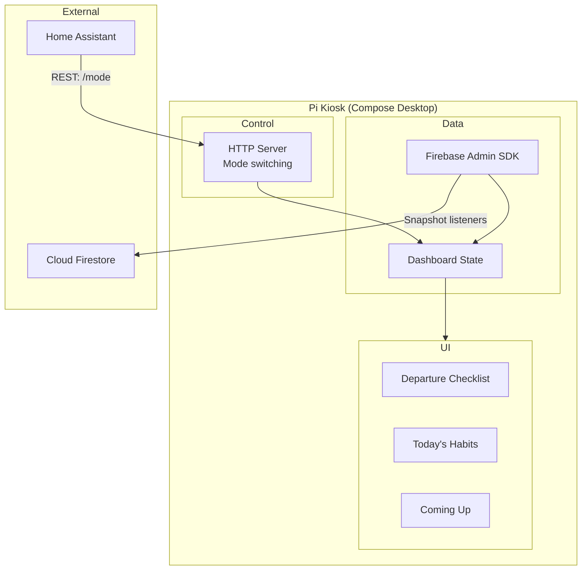

The dashboard uses the Firebase Admin SDK (JVM) for privileged read access to Firestore. It does not use Firebase Auth — the service account key provides server-level access appropriate for a trusted device on the home network.

---

## Dependency Injection

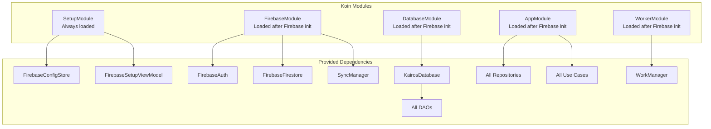

### Phased Koin Initialization

Koin modules load in two phases to support both standard builds (with `google-services.json` baked in) and self-hosted builds (where the user provides Firebase credentials at runtime).

**Phase 1 -- Always loaded on startup:**

`KairosApp.onCreate()` calls `startKoin` with only `setupModule`. This module provides `FirebaseConfigStore` (encrypted credential storage) and `FirebaseSetupViewModel` (setup screen logic). These are available immediately regardless of Firebase state.

**Phase 2 -- Conditional, after Firebase is available:**

Once Firebase is initialized, `KairosApp` calls `loadKoinModules()` with `firebaseModule` and all 11 remaining app modules (`dataModule`, `syncModule`, `authModule`, `domainModule`, etc.). The `firebaseModule` must load first because `dataModule`, `syncModule`, and `authModule` inject `FirebaseAuth` and `FirebaseFirestore` from the Koin graph.

**Three startup paths determine when Phase 2 runs:**

| Path          | Condition                                    | Behavior                                                                                                                                                                                                    |
| ------------- | -------------------------------------------- | ----------------------------------------------------------------------------------------------------------------------------------------------------------------------------------------------------------- |
| Auto-init     | `google-services.json` present at build time | Firebase auto-initializes via the google-services plugin. Phase 2 runs immediately in `onCreate()`.                                                                                                         |
| Stored config | Returning self-hoster with saved credentials | `FirebaseInitializer` reads credentials from `FirebaseConfigStore` and calls `FirebaseApp.initializeApp()`. Phase 2 runs immediately in `onCreate()`.                                                       |
| Fresh setup   | New self-hoster, no config yet               | Phase 2 is deferred. The app shows the Firebase Setup Screen. After the user pastes valid `google-services.json` content, the setup flow initializes Firebase and triggers Phase 2 via `loadKoinModules()`. |

`KairosApp` exposes a `firebaseReady: StateFlow<Boolean>` that the navigation layer observes. When `false`, the nav graph routes to the setup screen. When `true`, it routes to the today screen.

---

## Firebase Configuration & Self-Hosting

Kairos supports two paths for Firebase project configuration: build-time (standard) and runtime (self-hosted).

### Build-Time Path

When `app/google-services.json` exists, the `com.google.gms.google-services` Gradle plugin applies automatically and Firebase initializes via the default `FirebaseApp` mechanism on app startup. This is the path for CI builds and development environments that bundle the project's own Firebase credentials.

### Runtime Path (Self-Hosting)

For self-hosted builds distributed without `google-services.json` (e.g., GitHub Releases APKs), Firebase credentials are provided by the user at first launch:

1. The google-services Gradle plugin is conditionally applied in `app/build.gradle.kts` -- it is only added when `google-services.json` exists in the app module directory.
2. On first launch without bundled credentials, the app shows the **Firebase Setup Screen** before any other content.
3. The user pastes the contents of a `google-services.json` file obtained from their own Firebase project.
4. `FirebaseSetupViewModel` parses the JSON, extracting `project_id`, `mobilesdk_app_id`, `current_key` (API key), `storage_bucket`, and `project_number` (GCM sender ID).
5. Validated credentials are saved to `FirebaseConfigStore` (EncryptedSharedPreferences with AES256 encryption).
6. `FirebaseInitializer` constructs `FirebaseOptions` from the stored values and calls `FirebaseApp.initializeApp()`.
7. Phase 2 Koin modules load, and the app navigates to the today screen.

### Conditional google-services Plugin

```kotlin
// app/build.gradle.kts
if (file("google-services.json").exists()) {
    apply(plugin = "com.google.gms.google-services")
}
```

When the plugin is absent, no `google-services.json` processing occurs at build time. The app compiles and runs normally but defers Firebase initialization to runtime.

### Navigation Gating

`KairosNavGraph` uses `KairosApp.firebaseReady` to choose the start destination:

- `firebaseReady = false` -- start destination is `"firebase_setup"`
- `firebaseReady = true` -- start destination is `"today"`

After successful setup, the navigation clears the back stack so the user cannot navigate back to the setup screen.

---

## Error Handling Strategy

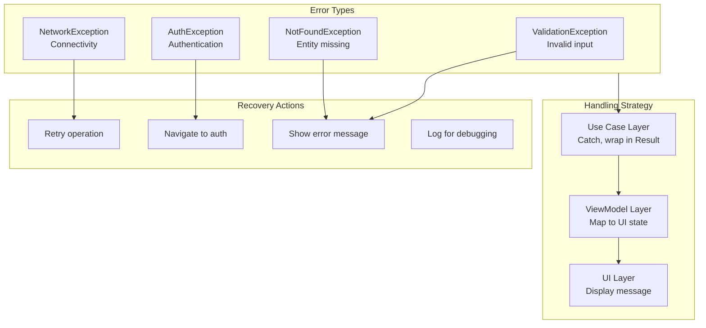

### Result Type Pattern

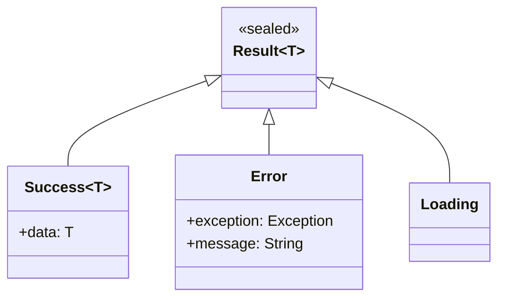

---

## Security Architecture

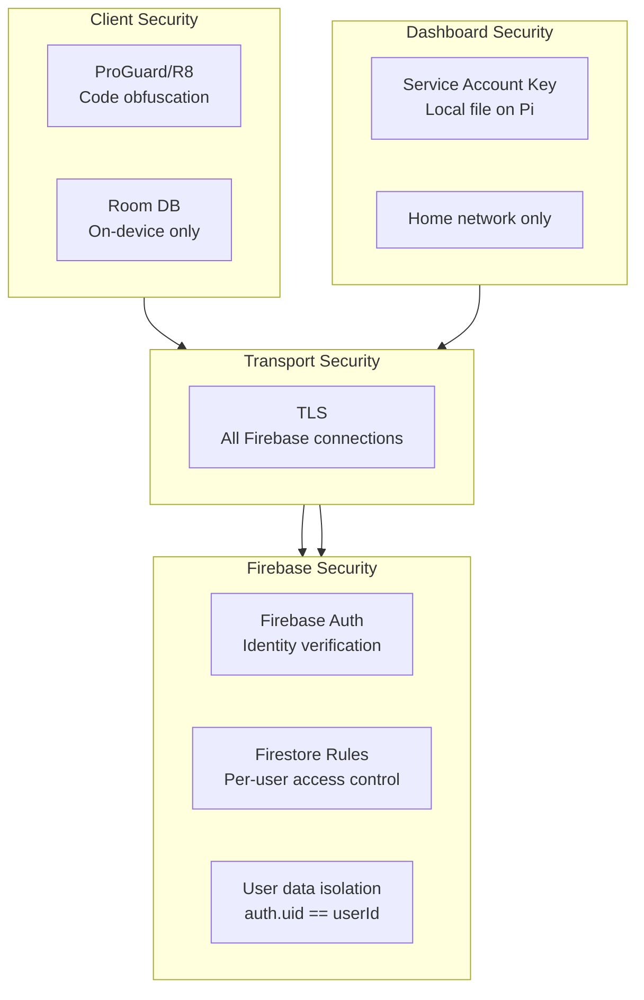

### Security Rules

| Rule             | Implementation                                   |
| ---------------- | ------------------------------------------------ |
| Token management | Firebase SDK (automatic refresh, secure storage) |
| Network          | TLS enforced by Firebase                         |
| Data isolation   | Firestore rules: `request.auth.uid == userId`    |
| PII in logs      | Prohibited, enforced by lint                     |
| Dashboard auth   | Service account key on trusted device            |

---

## Performance Considerations

### Database Optimization

| Optimization             | Purpose                      |
| ------------------------ | ---------------------------- |
| Indices on query columns | Fast habit/completion lookup |
| Paging for history       | Memory efficiency            |
| Precomputed views        | Today screen performance     |

### UI Optimization

| Optimization            | Purpose                     |
| ----------------------- | --------------------------- |
| Lazy composition        | Only render visible items   |
| Stable keys             | Minimize recomposition      |
| Async image loading     | Smooth scrolling            |
| Remember/derivedStateOf | Avoid redundant computation |

### Sync Optimization

| Optimization                     | Purpose                            |
| -------------------------------- | ---------------------------------- |
| Snapshot listeners (not polling) | Real-time with minimal reads       |
| Scoped listeners                 | Only listen to active collections  |
| Firestore offline cache          | Reduces network reads on app start |
| Batch writes                     | Group related Firestore updates    |

---

## Deployment Architecture

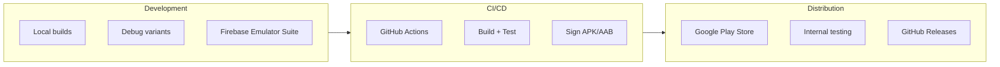

### Build Variants

| Variant | Firebase                | Logging    | Debuggable |
| ------- | ----------------------- | ---------- | ---------- |
| debug   | Emulator or dev project | Verbose    | Yes        |
| release | Production project      | Error only | No         |

### Firebase Emulator Suite

For local development, use the Firebase Emulator Suite to avoid hitting production:

- Auth emulator (no real email sending)
- Firestore emulator (local data, no charges)
- Configured via `firebase.json` and detected automatically by Android SDK
