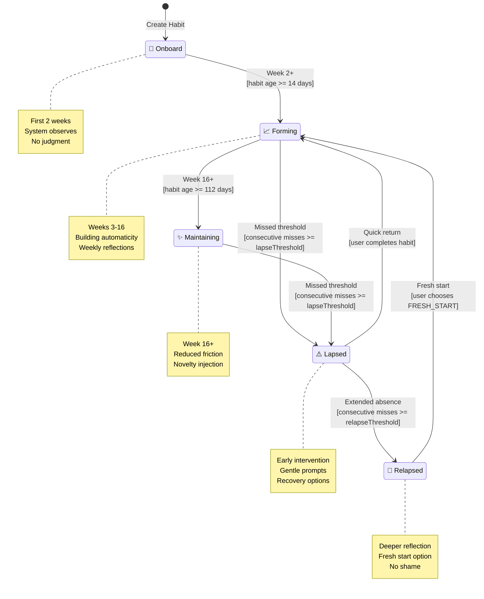
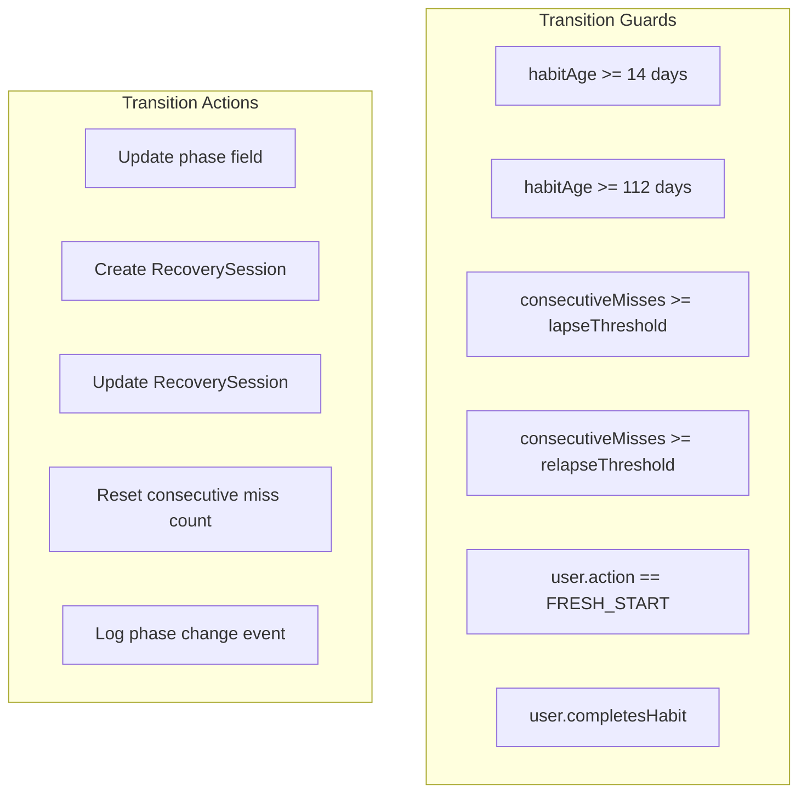
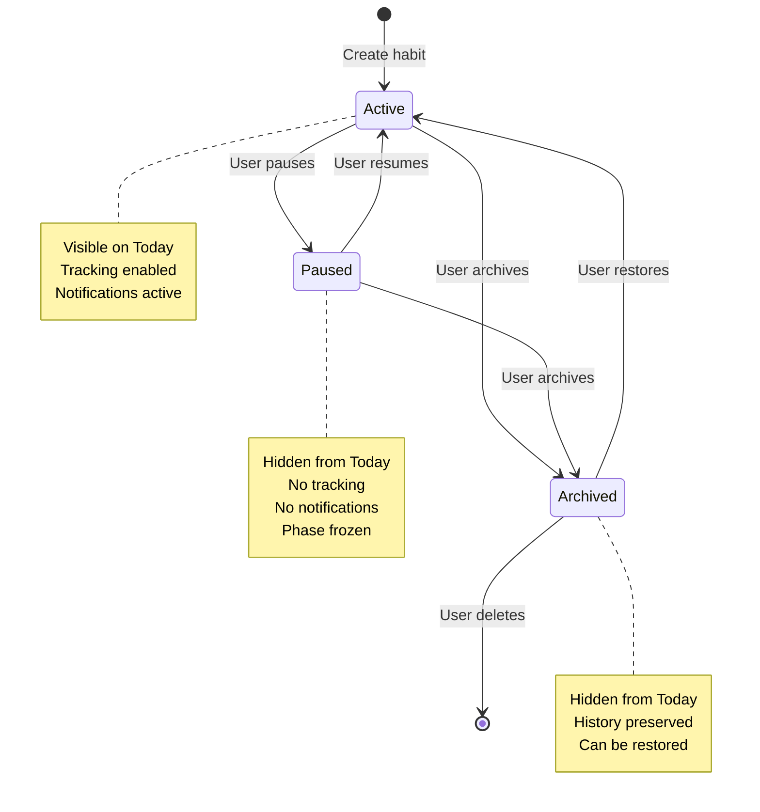
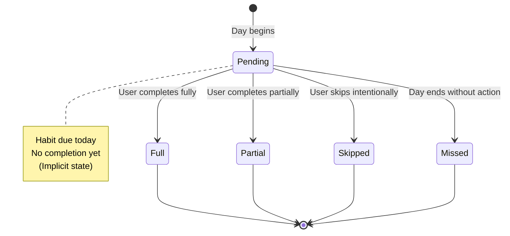
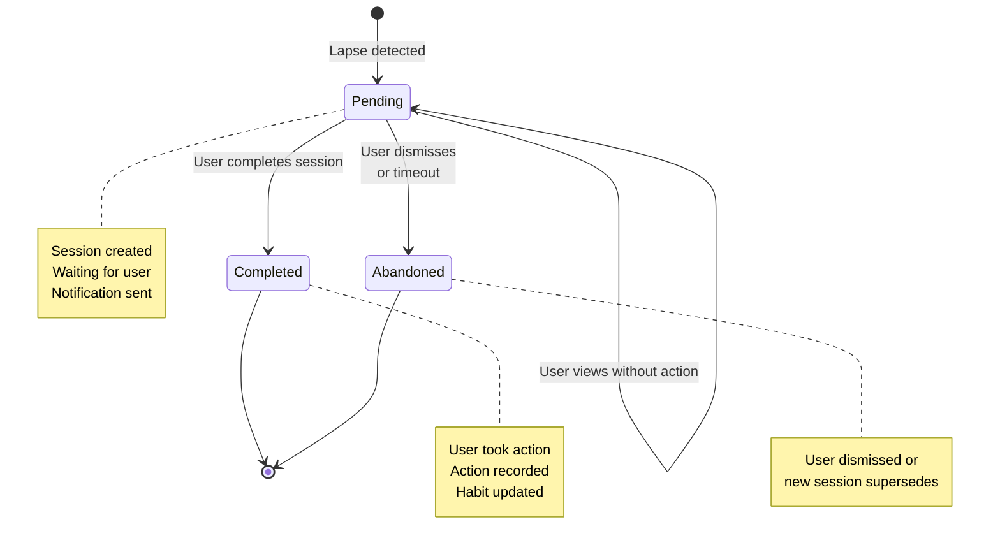
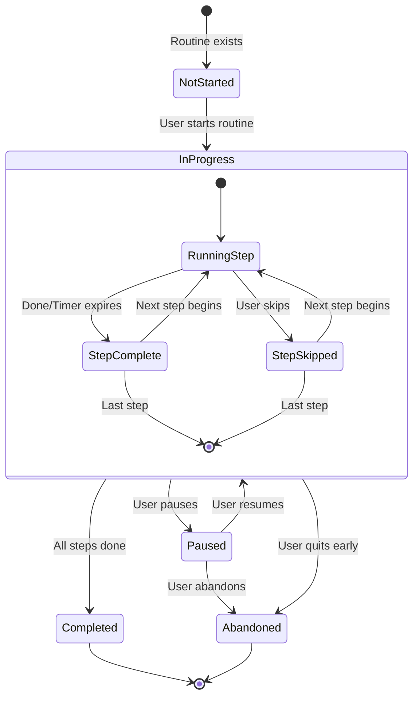
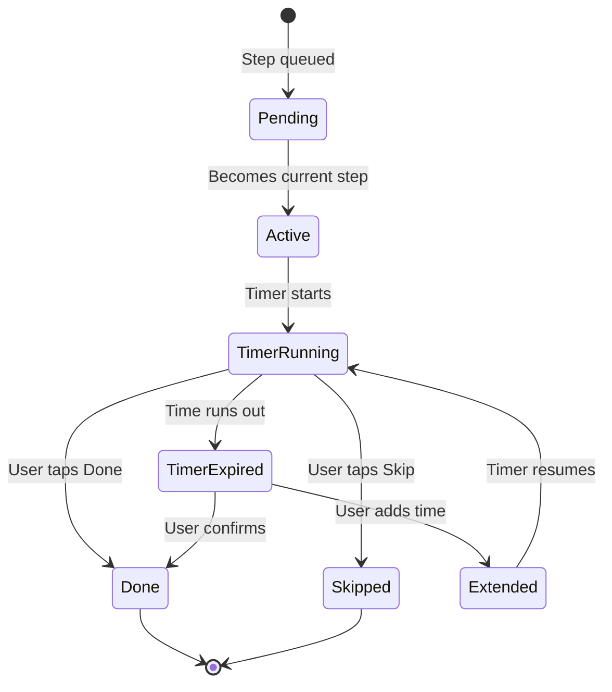
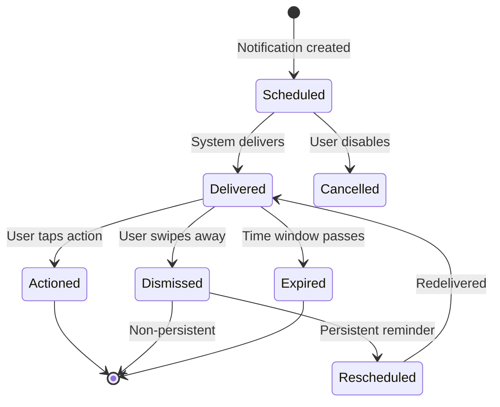
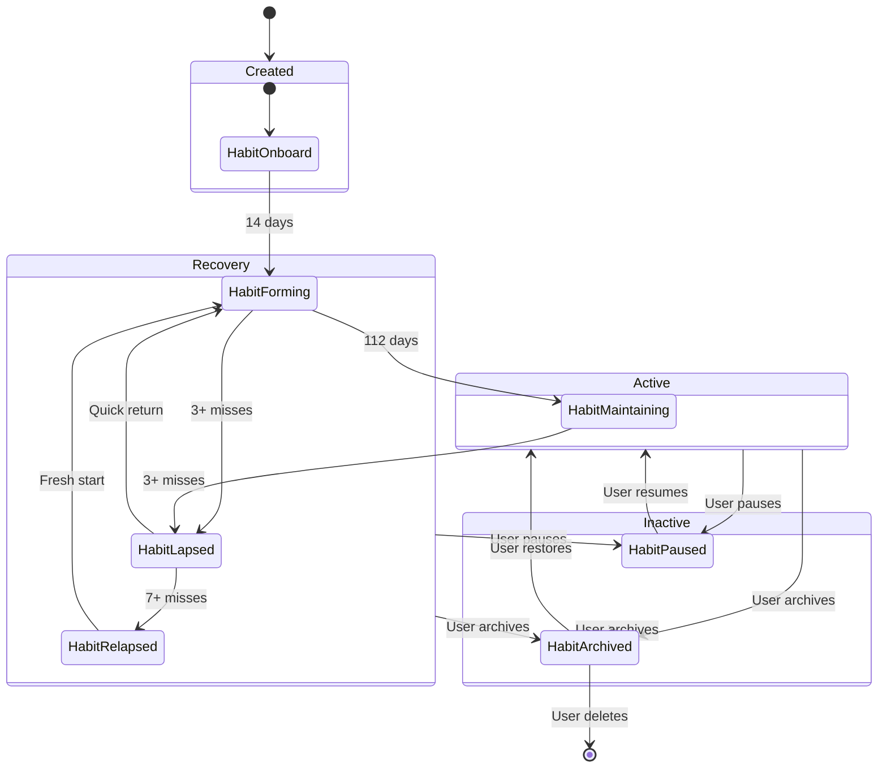
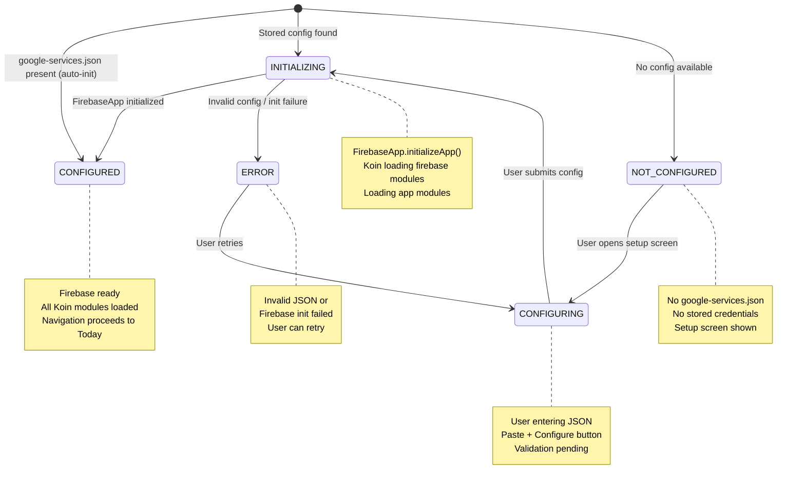

# State Machines

## Overview

This document defines all state machines in the Kairos system, including valid states, transitions, guards, and actions.

---

## Habit Lifecycle State Machine

The habit lifecycle is the core state machine governing how habits progress through phases.



### Phase Definitions

| Phase       | Duration   | Characteristics                       | Transitions Out                           |
| ----------- | ---------- | ------------------------------------- | ----------------------------------------- |
| ONBOARD     | Weeks 1-2  | Setup complete, observation period    | → FORMING (time)                          |
| FORMING     | Weeks 3-16 | Active tracking, building consistency | → MAINTAINING (time), → LAPSED (misses)   |
| MAINTAINING | Week 16+   | Low friction, novelty injection       | → LAPSED (misses)                         |
| LAPSED      | Variable   | 3-6 consecutive misses                | → FORMING (return), → RELAPSED (extended) |
| RELAPSED    | Variable   | 7+ consecutive misses                 | → FORMING (fresh start)                   |

### Phase Transition Rules



---

## Habit Status State Machine

Separate from phase, status controls visibility and activity.



### Status Transition Table

| From     | Event        | Guard          | To        | Actions                               |
| -------- | ------------ | -------------- | --------- | ------------------------------------- |
| ACTIVE   | UserPauses   | -              | PAUSED    | Set pausedAt, disable notifications   |
| ACTIVE   | UserArchives | -              | ARCHIVED  | Set archivedAt, disable notifications |
| PAUSED   | UserResumes  | -              | ACTIVE    | Clear pausedAt, restore notifications |
| PAUSED   | UserArchives | -              | ARCHIVED  | Set archivedAt                        |
| ARCHIVED | UserRestores | -              | ACTIVE    | Clear archivedAt                      |
| ARCHIVED | UserDeletes  | Confirm dialog | (deleted) | Remove entity                         |

---

## Completion Type State Machine

Completions are final—no state changes after creation.



### Completion Type Details

| Type    | Trigger           | User Action | System Action        |
| ------- | ----------------- | ----------- | -------------------- |
| FULL    | User taps Done    | Required    | Never                |
| PARTIAL | User taps Partial | Required    | Never                |
| SKIPPED | User taps Skip    | Required    | Never                |
| MISSED  | End of day        | Never       | LapseDetectionWorker |

---

## Sync Status (Firebase)

> **Note:** With Firebase/Firestore, sync state is managed internally by the Firestore SDK. The app does not track per-entity sync status via a state machine. Firestore's SDK handles offline queuing, push on reconnect, and conflict resolution (last-write-wins) automatically.
>
> The conceptual states still exist — an entity is either local-only (user not signed in), synced, or pending sync (offline queue) — but these are not app-managed states. The SyncManager layer observes Firestore snapshot listeners for remote changes and pushes local Room changes to Firestore, but does not maintain a state machine per entity.

---

## Recovery Session State Machine

Manages the lifecycle of recovery interventions.



### Session Completion Actions

| Action      | Effect on Habit                         | Session Result |
| ----------- | --------------------------------------- | -------------- |
| RESUME      | Phase → FORMING                         | Completed      |
| SIMPLIFY    | Activate micro-version, Phase → FORMING | Completed      |
| PAUSE       | Status → PAUSED                         | Completed      |
| ARCHIVE     | Status → ARCHIVED                       | Completed      |
| FRESH_START | Phase → FORMING, reset tracking         | Completed      |
| (dismiss)   | No change                               | Abandoned      |

---

## Routine Execution State Machine

Tracks the progress of a routine run.



### Execution State Details

| State       | Timer  | UI                       | Persistence         |
| ----------- | ------ | ------------------------ | ------------------- |
| NOT_STARTED | -      | Start button visible     | -                   |
| IN_PROGRESS | Active | Current step highlighted | Step index saved    |
| PAUSED      | Frozen | Resume button visible    | State preserved     |
| COMPLETED   | -      | Summary shown            | Completions created |
| ABANDONED   | -      | Partial recorded         | Partial completions |

### Step State Machine (Within Execution)



---

## Notification State Machine

Tracks notification delivery and user response.



### Notification Actions by Type

| Notification Type | Available Actions          |
| ----------------- | -------------------------- |
| Habit Reminder    | Complete, Snooze 15m, Skip |
| Recovery Prompt   | Open Recovery, Dismiss     |
| Fresh Start       | View Habits, Dismiss       |
| Routine Timer     | Done, Skip, Pause          |
| Sync Error        | Retry, Open Settings       |

---

## Combined State Diagram: Habit Complete Lifecycle



---

## State Machine Implementation Patterns

### Sealed Class Pattern (Kotlin)

```kotlin
sealed class HabitPhase {
    object Onboard : HabitPhase()
    object Forming : HabitPhase()
    object Maintaining : HabitPhase()
    object Lapsed : HabitPhase()
    object Relapsed : HabitPhase()

    fun canTransitionTo(target: HabitPhase): Boolean = when (this) {
        is Onboard -> target is Forming
        is Forming -> target in listOf(Maintaining, Lapsed)
        is Maintaining -> target is Lapsed
        is Lapsed -> target in listOf(Forming, Relapsed)
        is Relapsed -> target is Forming
    }
}
```

### State Machine Engine Pattern

```kotlin
class HabitStateMachine(
    private val habit: Habit,
    private val repository: HabitRepository
) {
    fun transition(event: HabitEvent): Result<Habit> {
        val currentPhase = habit.phase
        val newPhase = when (event) {
            is HabitEvent.TimeElapsed -> evaluateTimeTransition(habit)
            is HabitEvent.MissedDays -> evaluateMissTransition(habit, event.count)
            is HabitEvent.UserCompleted -> evaluateCompletionTransition(habit)
            is HabitEvent.FreshStart -> HabitPhase.Forming
        }

        return if (currentPhase.canTransitionTo(newPhase)) {
            val updated = habit.copy(phase = newPhase, updatedAt = Instant.now())
            repository.update(updated)
            Result.success(updated)
        } else {
            Result.failure(IllegalStateTransition(currentPhase, newPhase))
        }
    }
}
```

---

## Transition Summary Table

### Habit Phase Transitions

| Current     | Event         | Guard            | Next        | Action                   |
| ----------- | ------------- | ---------------- | ----------- | ------------------------ |
| ONBOARD     | TimeElapsed   | age >= 14d       | FORMING     | Log transition           |
| FORMING     | TimeElapsed   | age >= 112d      | MAINTAINING | Log transition           |
| FORMING     | MissedDays    | count >= lapse   | LAPSED      | Create RecoverySession   |
| MAINTAINING | MissedDays    | count >= lapse   | LAPSED      | Create RecoverySession   |
| LAPSED      | UserCompleted | -                | FORMING     | Complete RecoverySession |
| LAPSED      | MissedDays    | count >= relapse | RELAPSED    | Update RecoverySession   |
| RELAPSED    | FreshStart    | -                | FORMING     | Complete RecoverySession |

### Habit Status Transitions

| Current  | Event        | Guard   | Next      | Action           |
| -------- | ------------ | ------- | --------- | ---------------- |
| ACTIVE   | UserPauses   | -       | PAUSED    | Set pausedAt     |
| ACTIVE   | UserArchives | -       | ARCHIVED  | Set archivedAt   |
| PAUSED   | UserResumes  | -       | ACTIVE    | Clear pausedAt   |
| PAUSED   | UserArchives | -       | ARCHIVED  | Set archivedAt   |
| ARCHIVED | UserRestores | -       | ACTIVE    | Clear archivedAt |
| ARCHIVED | UserDeletes  | Confirm | (deleted) | Delete entity    |

---

## Firebase Configuration State Machine

Manages the app's Firebase initialization lifecycle at startup. Determines whether the app can proceed to the main experience or must present the setup screen for self-hosters to enter Firebase credentials.



### State Definitions

| State          | Entry Condition                                   | UI                              | Koin Modules Loaded                                      |
| -------------- | ------------------------------------------------- | ------------------------------- | -------------------------------------------------------- |
| NOT_CONFIGURED | No google-services.json and no stored config      | Setup screen                    | setupModule only                                         |
| CONFIGURING    | User is on setup screen entering credentials      | Setup screen (input active)     | setupModule only                                         |
| INITIALIZING   | Config submitted or stored config found at launch | Loading indicator               | setupModule only (firebase modules loading)              |
| CONFIGURED     | FirebaseApp successfully initialized              | Today screen (or auth)          | All modules (setupModule + firebaseModule + app modules) |
| ERROR          | Invalid config or FirebaseApp init failure        | Setup screen with error message | setupModule only                                         |

### Transition Table

| Current        | Event             | Guard                                       | Next           | Actions                                                                                                                              |
| -------------- | ----------------- | ------------------------------------------- | -------------- | ------------------------------------------------------------------------------------------------------------------------------------ |
| (launch)       | AppStart          | google-services.json exists                 | CONFIGURED     | Auto-init Firebase, load all Koin modules                                                                                            |
| (launch)       | AppStart          | Stored config in EncryptedSharedPreferences | CONFIGURED     | Read stored config, init Firebase synchronously, load all Koin modules (INITIALIZING state is transient/imperceptible for this path) |
| (launch)       | AppStart          | No config available                         | NOT_CONFIGURED | Show setup screen                                                                                                                    |
| NOT_CONFIGURED | UserOpensSetup    | -                                           | CONFIGURING    | Display JSON input field                                                                                                             |
| CONFIGURING    | UserSubmitsConfig | JSON non-empty                              | INITIALIZING   | Parse JSON, store in EncryptedSharedPreferences, call FirebaseApp.initializeApp()                                                    |
| INITIALIZING   | InitSuccess       | FirebaseApp ready                           | CONFIGURED     | Load firebaseModule + all app Koin modules, set firebaseReady = true                                                                 |
| INITIALIZING   | InitFailure       | Exception thrown                            | ERROR          | Display error message, clear invalid stored config                                                                                   |
| ERROR          | UserRetries       | -                                           | CONFIGURING    | Reset input, allow re-entry                                                                                                          |
