# User Flows & Experience Design

## Overview

This document maps the key user journeys through Kairos, detailing screens, interactions, and decision points.

---

## Flow Index

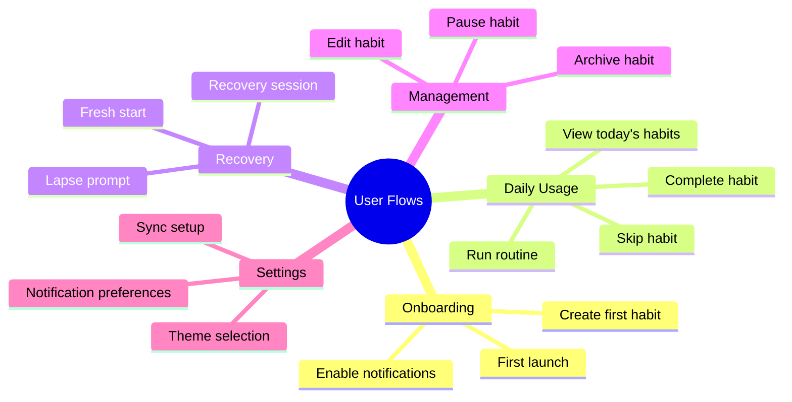

---

## Flow 1: First Launch & Onboarding

### Firebase Configuration Check

On every app launch, the first decision point is whether Firebase is available. This check runs before any onboarding or content screens.

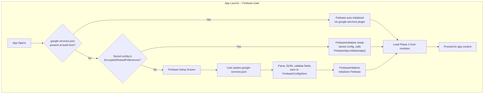

| Firebase state                                              | Startup behavior                                                               |
| ----------------------------------------------------------- | ------------------------------------------------------------------------------ |
| Auto-initialized (CI/dev build with `google-services.json`) | Proceed directly to onboarding (first launch) or today screen (returning user) |
| Stored config exists (returning self-hoster)                | Initialize Firebase from encrypted store, then proceed to today screen         |
| No config (new self-hoster)                                 | Show Firebase Setup Screen; app is gated until configuration completes         |

### Firebase Setup Screen

Self-hosters see this screen before any other content on first launch. After successful configuration, the app navigates directly to the today screen (skipping onboarding, since self-hosters are power users).

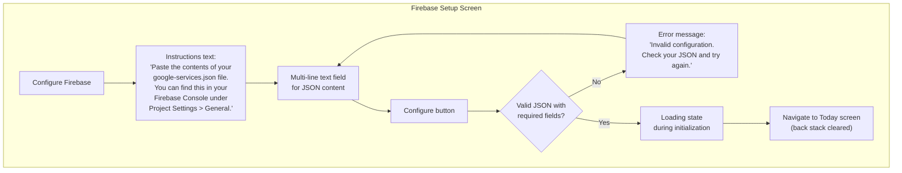

| Element          | Details                                                                                                                                                                            |
| ---------------- | ---------------------------------------------------------------------------------------------------------------------------------------------------------------------------------- |
| Screen title     | "Configure Firebase"                                                                                                                                                               |
| Instructions     | Explains what to paste and where to obtain the `google-services.json` file from the Firebase Console                                                                               |
| Text input       | Multi-line text field accepting raw JSON content                                                                                                                                   |
| Configure button | Triggers parse, validate, save, and initialize sequence                                                                                                                            |
| Error state      | Displayed inline when JSON is malformed or missing required fields (`project_id`, `mobilesdk_app_id`, `current_key`, `storage_bucket`, `project_number`). User can edit and retry. |
| Loading state    | Shown during `FirebaseApp.initializeApp()` and Koin module loading                                                                                                                 |
| Post-setup note  | Self-hosters must also deploy `firestore.rules` (in the repo root) to their Firebase project for security rules to take effect                                                     |

### Standard Onboarding (After Firebase Is Ready)

For builds with `google-services.json` baked in, the standard onboarding flow applies on first launch:

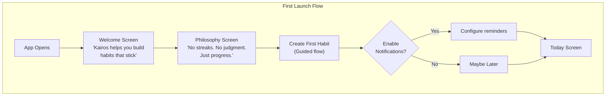

### Welcome Screen

| Element      | Content                                                     |
| ------------ | ----------------------------------------------------------- |
| Illustration | Calm, non-gamified visual                                   |
| Headline     | "Kairos"                                                    |
| Subhead      | "Habit building designed for how your brain actually works" |
| CTA          | "Get Started"                                               |
| Skip         | Not available (must see philosophy)                         |

### Philosophy Screen

| Element  | Content                               |
| -------- | ------------------------------------- |
| Headline | "Three things we do differently"      |
| Point 1  | "No streaks to break" with icon       |
| Point 2  | "Partial completion counts" with icon |
| Point 3  | "Recovery is built in" with icon      |
| CTA      | "Create Your First Habit"             |

---

## Flow 2: Create Habit

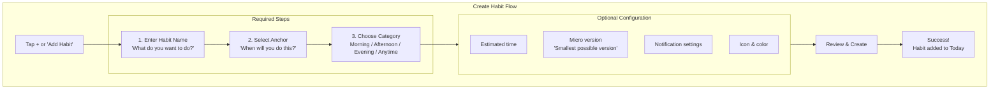

### Create Habit: Name Input

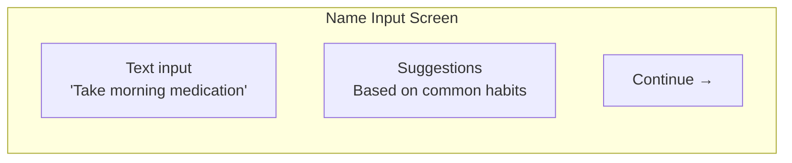

| UI Element      | Behavior                     |
| --------------- | ---------------------------- |
| Text input      | Auto-focus, 1-100 characters |
| Character count | Subtle indicator             |
| Suggestions     | Tap to fill, categorized     |
| Continue        | Enabled when name valid      |

### Create Habit: Anchor Selection

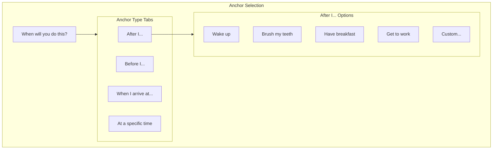

| Anchor Type     | Input Method         | Examples                 |
| --------------- | -------------------- | ------------------------ |
| After behavior  | Preset list + custom | "After I brush my teeth" |
| Before behavior | Preset list + custom | "Before I start work"    |
| At location     | Location picker      | "When I arrive at gym"   |
| At time         | Time picker          | "At 7:00 AM"             |

### Create Habit: Category

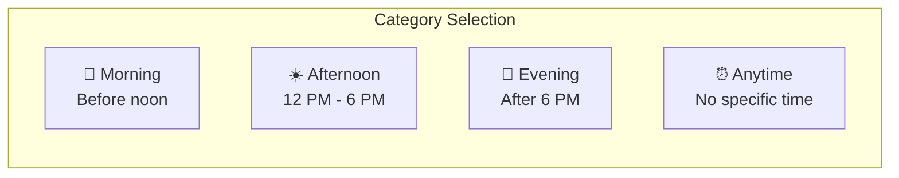

---

## Flow 3: Today Screen

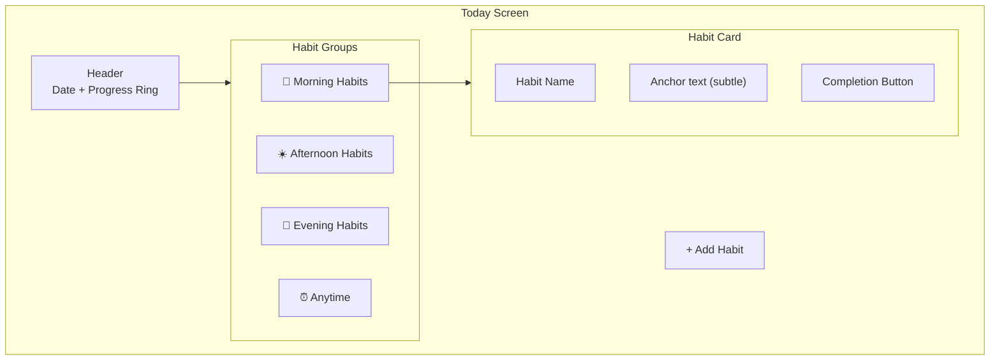

### Today Screen States

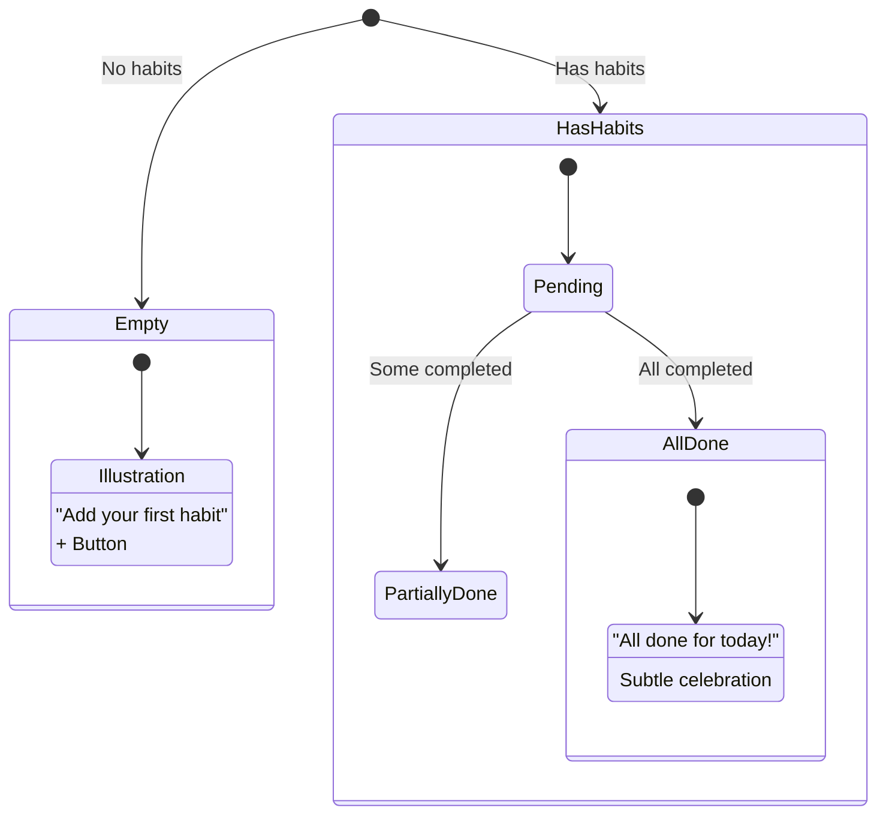

### Habit Card Interaction

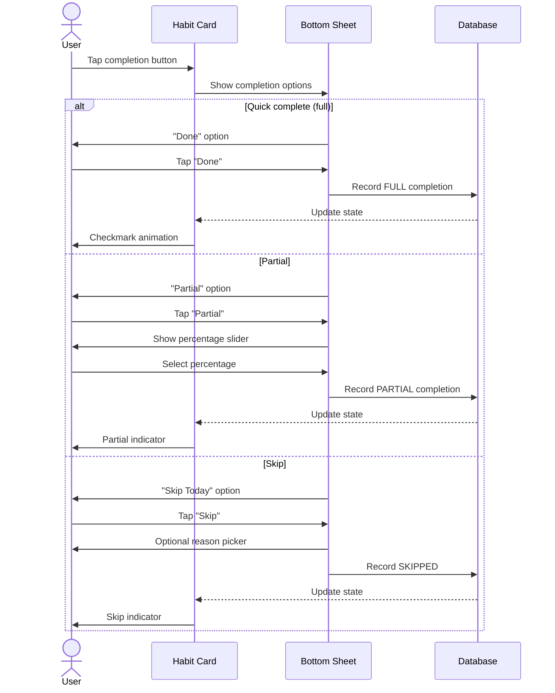

---

## Flow 4: Complete Habit

### Quick Complete (Single Tap)

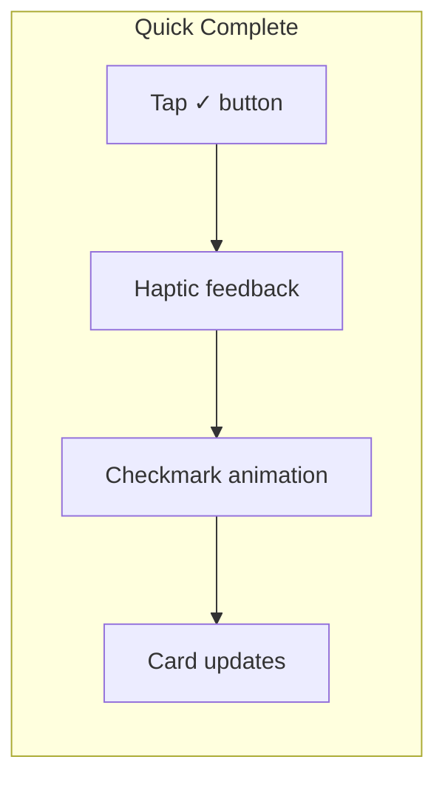

### Full Completion Sheet

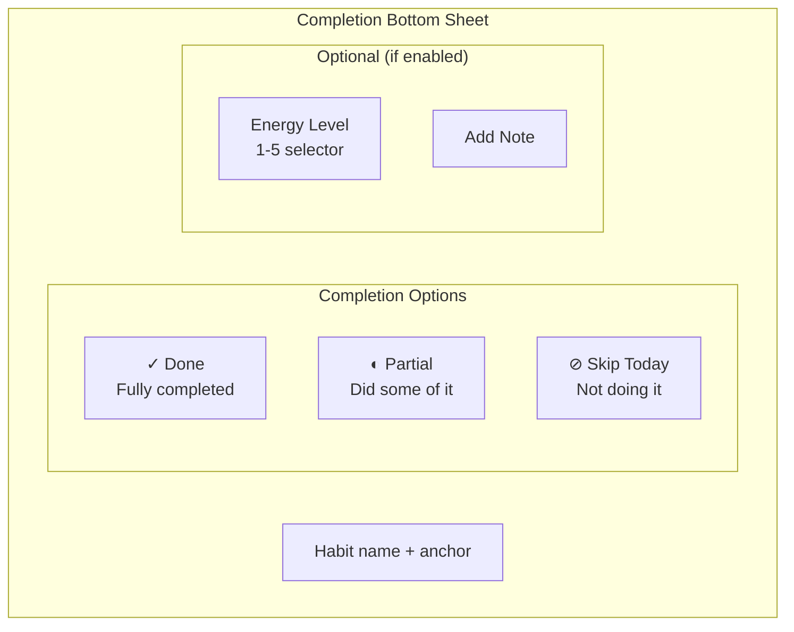

---

## Flow 5: Run Routine

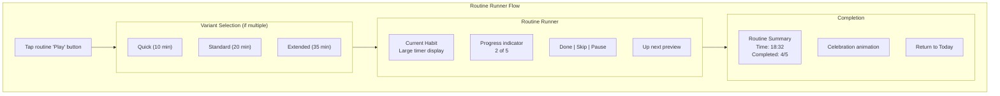

### Routine Runner Screen

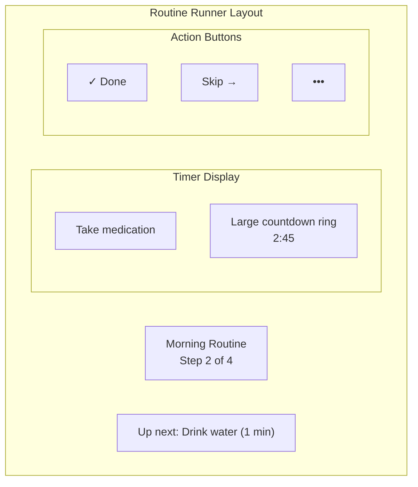

---

## Flow 6: Recovery (Lapse)

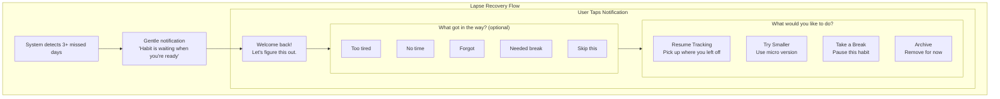

### Recovery Session UI

| Screen  | Purpose          | Messaging                                       |
| ------- | ---------------- | ----------------------------------------------- |
| Welcome | Warm return      | "Welcome back! Let's figure this out together." |
| Blocker | Optional data    | "What got in the way? (This helps us help you)" |
| Actions | Choose path      | Clear options, no judgment                      |
| Confirm | Reinforce choice | "Great choice. Your habit is ready."            |

---

## Flow 7: Fresh Start (Relapse)

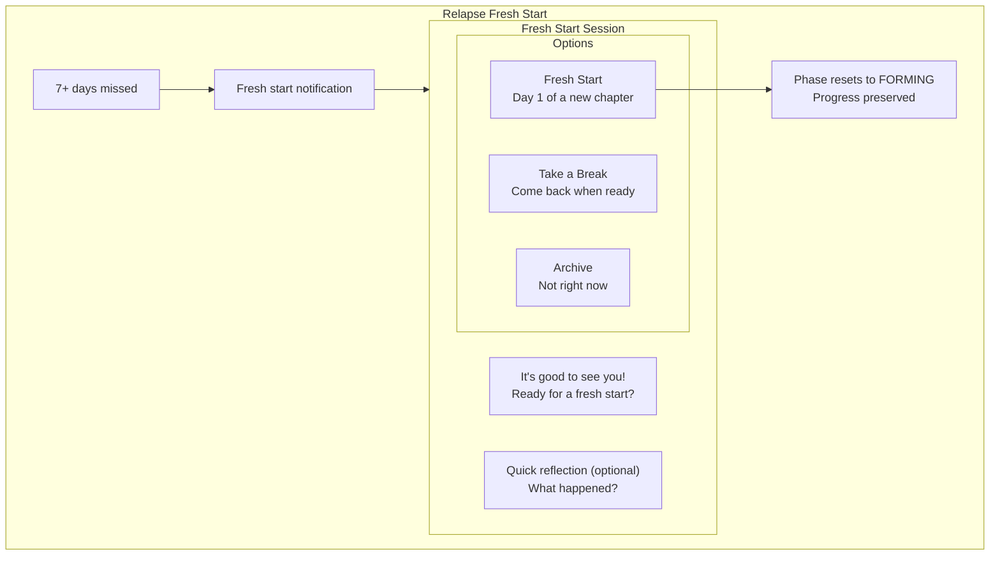

---

## Flow 8: Settings & Sync

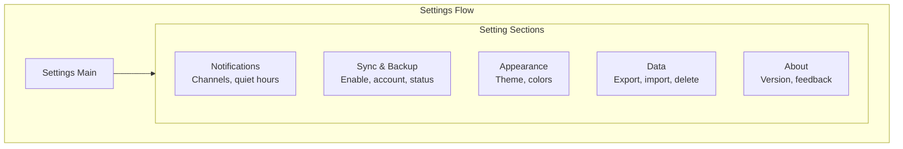

### Sync Setup Flow

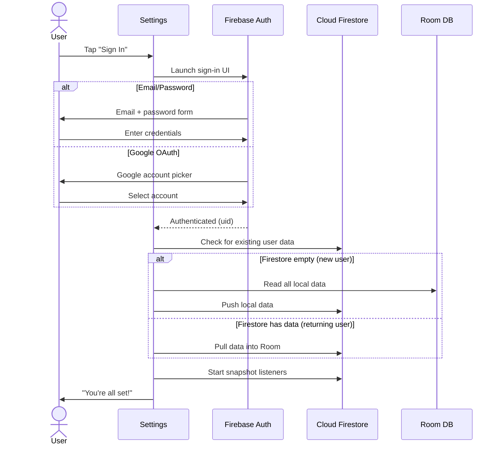

---

## Flow 9: WearOS Interactions

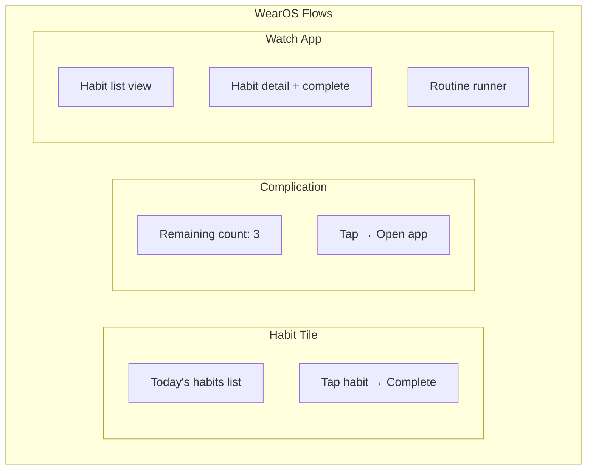

### Watch Complete Flow

```mermaid
sequenceDiagram
    actor User
    participant Watch
    participant Phone
    participant Firestore

    User->>Watch: Tap habit on tile
    Watch->>Watch: Show confirm dialog
    User->>Watch: Confirm "Done"
    Watch->>Watch: Record completion locally
    Watch->>User: Haptic + visual confirm

    Watch->>Phone: Sync via Data Layer
    Phone->>Phone: Update Room DB
    Phone->>Firestore: Push completion
```

---

## Error States & Empty States

### Error Handling Flows

```mermaid
flowchart TB
    subgraph Errors["Error States"]
        SyncError["Sync failed<br/>'Changes saved locally'<br/>Retry button"]
        NetworkError["Offline<br/>'You're offline'<br/>Local mode active"]
        AuthError["Session expired<br/>'Please sign in again'<br/>Sign in button"]
    end
```

### Empty States

| Screen            | Empty State                           | CTA              |
| ----------------- | ------------------------------------- | ---------------- |
| Today (no habits) | Illustration + "Add your first habit" | Add Habit button |
| Today (all done)  | "All done for today! 🎉"              | None needed      |
| Routines (none)   | "Group habits into routines"          | Create Routine   |
| History (no data) | "Your history will appear here"       | None             |

---

## Interaction Specifications

### Tap Targets

| Element           | Minimum Size | Recommended Size |
| ----------------- | ------------ | ---------------- |
| Primary buttons   | 48dp         | 56dp             |
| Completion button | 48dp         | 64dp             |
| List items        | 48dp height  | 72dp height      |
| Icon buttons      | 48dp         | 48dp             |

### Animations

| Action            | Animation              | Duration |
| ----------------- | ---------------------- | -------- |
| Habit complete    | Checkmark draw + scale | 300ms    |
| Card expand       | Height + fade          | 200ms    |
| Screen transition | Shared element         | 300ms    |
| Progress update   | Ring fill              | 400ms    |

### Haptic Feedback

| Action            | Haptic Type    |
| ----------------- | -------------- |
| Habit complete    | Success (tick) |
| Button tap        | Light click    |
| Error             | Error pattern  |
| Routine step done | Medium click   |

---

## Accessibility

### Screen Reader Support

| Element           | Content Description             |
| ----------------- | ------------------------------- |
| Completion button | "Complete [habit name], button" |
| Progress ring     | "[X] of [Y] habits completed"   |
| Habit card        | "[name], [status], [anchor]"    |

### Motion Reduction

| Animation     | Reduced Motion Alternative |
| ------------- | -------------------------- |
| Celebration   | Static checkmark           |
| Progress ring | Instant fill               |
| Transitions   | Fade only                  |
