# WearOS Integration Design

## Overview

WearOS integration is a key differentiator for Kairos—it reduces phone dependency, which is critical for ADHD users who find phones distracting. The watch serves as a low-friction completion device and gentle reminder system.

---

## Design Philosophy

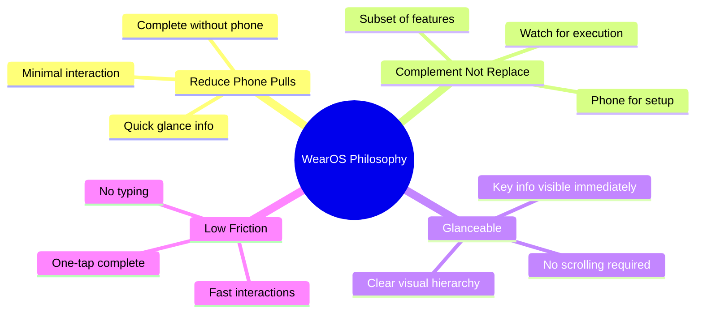

### WearOS-Specific Constraints

| Constraint | Implication |
|------------|-------------|
| Small screen | Prioritize essential info only |
| Limited battery | Minimize background processing |
| Short interactions | Design for <5 second sessions |
| No keyboard | No text input, selection only |
| Connectivity | May be disconnected from phone |

---

## Feature Scope

### Included on Watch

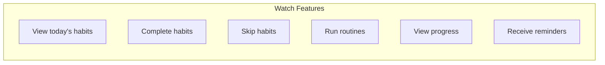

### Phone Only

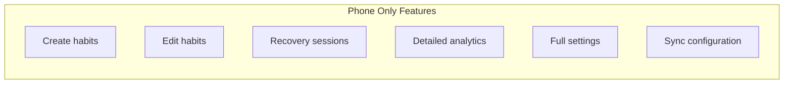

---

## Watch Components

### Component Overview

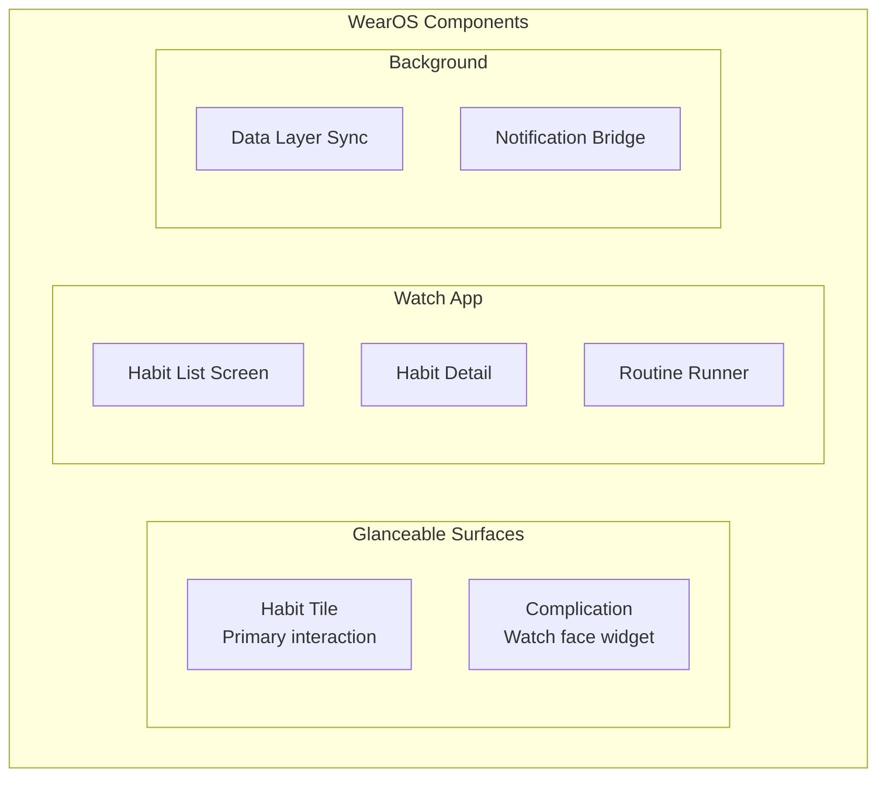

---

## Tile Design

### Habit Tile Layout

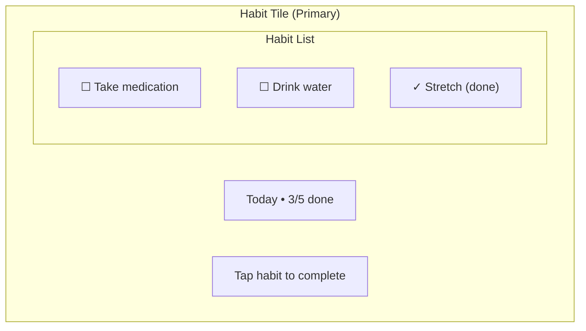

### Tile States

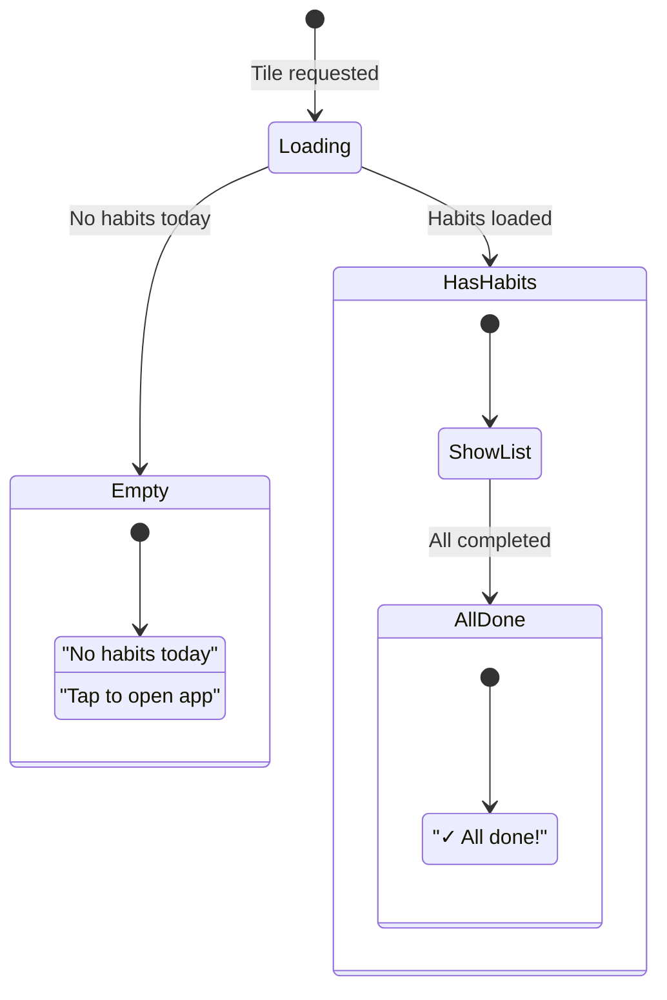

### Tile Interaction

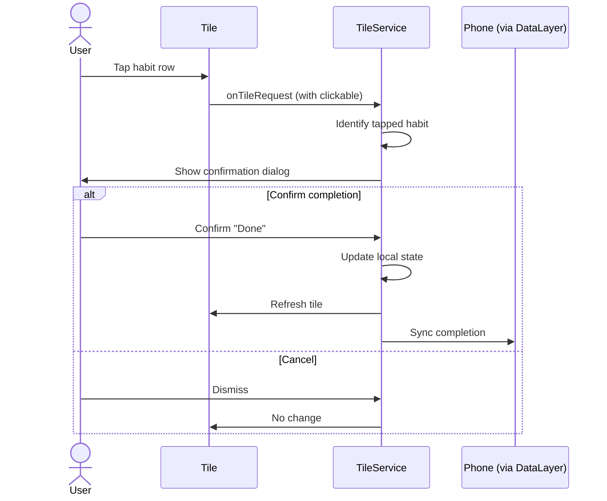

### Tile Technical Specs

| Spec | Value |
|------|-------|
| Max habits shown | 5 (scrollable) |
| Refresh rate | On data change + every 15 min |
| Clickable elements | Each habit row |
| Tile type | Single tile, full-width |

---

## Complication Design

### Complication Types

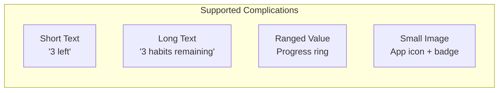

### Complication Data

| Type | Display | Tap Action |
|------|---------|------------|
| SHORT_TEXT | "3 left" or "✓ Done" | Open tile |
| LONG_TEXT | "3 habits remaining" | Open tile |
| RANGED_VALUE | Progress percentage | Open app |
| SMALL_IMAGE | Icon with count badge | Open app |

### Complication States

| State | Short Text | Long Text | Icon |
|-------|------------|-----------|------|
| Habits pending | "3 left" | "3 habits remaining" | App icon |
| All done | "✓" | "All done for today" | Checkmark |
| No habits | "—" | "No habits today" | App icon (dim) |

---

## Watch App Screens

### Screen Flow

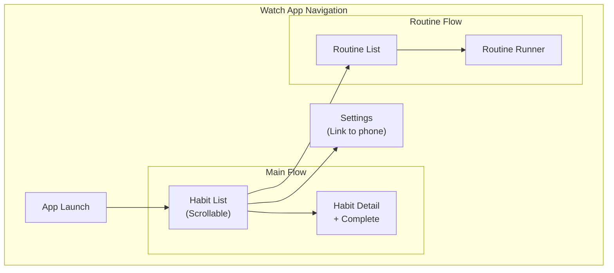

### Habit List Screen

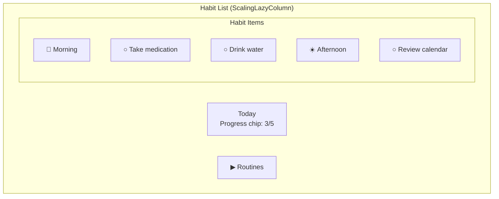

| Element | Component | Behavior |
|---------|-----------|----------|
| Header | Text + Chip | Static |
| Category | Text | Section header |
| Habit item | Chip (toggleable) | Tap → Detail or confirm |
| Routine link | Chip | Tap → Routine list |

### Habit Detail Screen

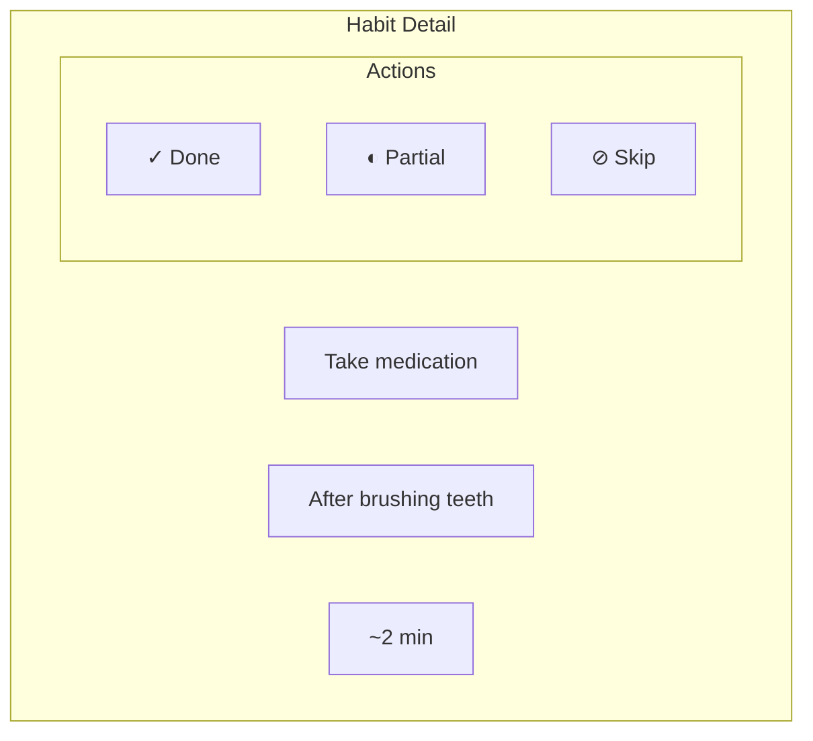

### Routine Runner (Watch)

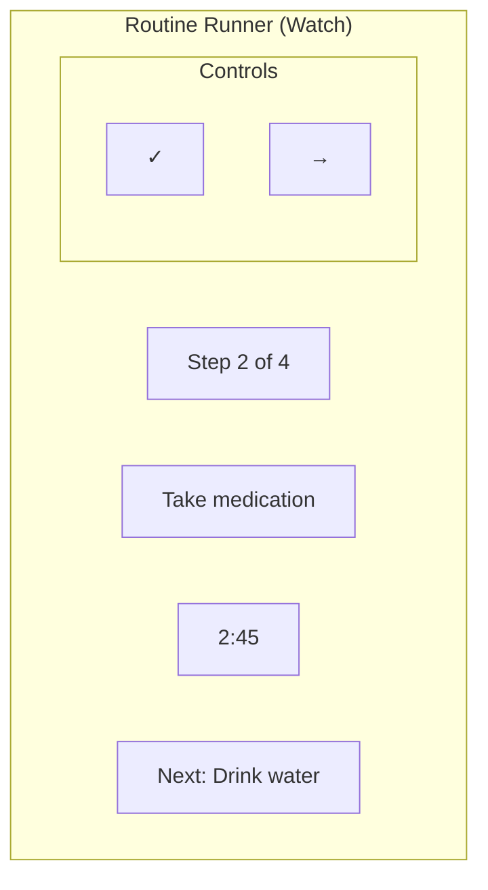

| Feature | Watch | Phone |
|---------|-------|-------|
| Start routine | ✓ | ✓ |
| View current step | ✓ | ✓ |
| Done/Skip controls | ✓ | ✓ |
| Pause routine | ✓ | ✓ |
| Variant selection | ❌ (uses default) | ✓ |
| View full summary | ❌ | ✓ |

---

## Data Synchronization

### Data Layer Architecture

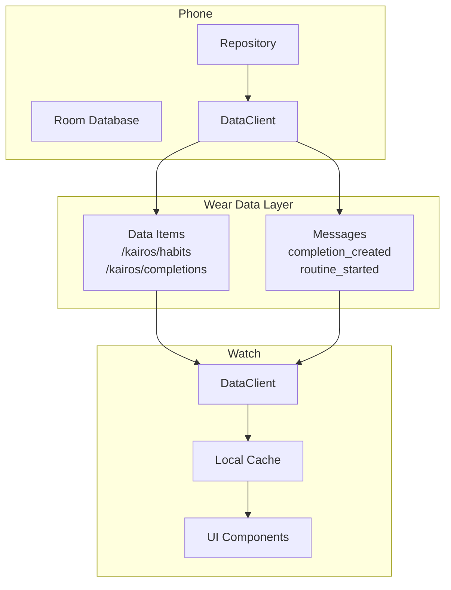

### Sync Strategy

| Data Type | Sync Method | Direction |
|-----------|-------------|-----------|
| Today's habits | DataItem | Phone → Watch |
| Today's completions | DataItem | Bidirectional |
| Active routine | DataItem | Bidirectional |
| Completion action | Message | Watch → Phone |
| Routine control | Message | Watch → Phone |

### Data Item Paths

| Path | Content | Update Frequency |
|------|---------|------------------|
| `/kairos/today/habits` | Today's habits JSON | On change |
| `/kairos/today/completions` | Today's completions JSON | On change |
| `/kairos/routine/active` | Active routine state | Real-time |
| `/kairos/config` | User preferences subset | On change |

### Message Types

| Message | Payload | Handler |
|---------|---------|---------|
| `habit_completed` | habitId, type, timestamp | Phone creates completion |
| `habit_skipped` | habitId, reason | Phone creates completion |
| `routine_started` | routineId | Phone starts routine |
| `routine_step_done` | executionId, stepIndex | Phone updates execution |
| `routine_paused` | executionId | Phone pauses routine |

---

## Offline Behavior

### Watch Standalone Mode

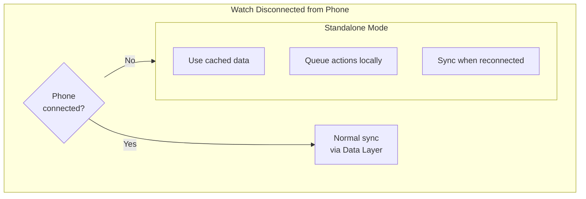

### Offline Capabilities

| Feature | Offline Behavior |
|---------|------------------|
| View habits | ✓ (cached) |
| Complete habit | ✓ (queued) |
| View completions | ✓ (cached) |
| Run routine | ✓ (local state) |
| Receive reminders | ✓ (bridged or local) |

### Sync Queue

When watch reconnects to phone:
1. Push queued completions
2. Push routine state
3. Pull latest habits/completions
4. Refresh tile and complications

---

## Notifications on Watch

### Bridged Notifications

| Phone Notification | Watch Behavior |
|-------------------|----------------|
| Habit reminder | Bridged with Done/Snooze/Skip |
| Lapse prompt | Bridged (opens on phone) |
| Fresh start | Bridged (opens on phone) |
| Routine timer | Bridged with controls |

### Watch Actions

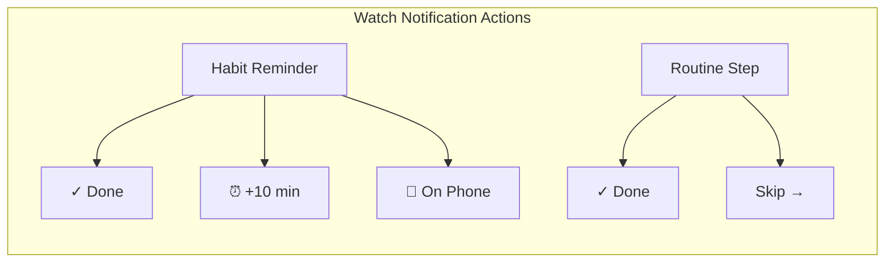

---

## UI Components (Wear Compose)

### Chip Styles

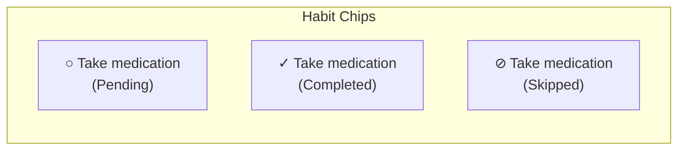

### Progress Indicators

| Context | Indicator |
|---------|-----------|
| Daily progress | Circular progress (complication) |
| Routine progress | Linear step indicator |
| Routine timer | Countdown with progress ring |

### Color Scheme

| State | Color | Usage |
|-------|-------|-------|
| Pending | Surface | Uncompleted habits |
| Completed | Primary | Completed habits |
| Skipped | Surface variant | Skipped habits |
| Routine active | Primary | Current step |

---

## Performance Considerations

### Battery Optimization

| Strategy | Implementation |
|----------|----------------|
| Minimal wake locks | Only for routine timer |
| Efficient tile updates | Debounce rapid changes |
| Lazy data loading | Load on-demand |
| Compression | Compress data items |

### Memory Management

| Limit | Value |
|-------|-------|
| Cached habits | Today only |
| Cached completions | Today only |
| Max data item size | 100 KB |

### Tile Performance

| Metric | Target |
|--------|--------|
| Tile render time | < 100ms |
| Data fetch time | < 500ms |
| Total load time | < 1 second |

---

## Testing Considerations

### Test Scenarios

| Scenario | Test Case |
|----------|-----------|
| Phone connected | Normal sync, real-time updates |
| Phone disconnected | Standalone mode, queue actions |
| Reconnection | Queue flush, state reconciliation |
| Low battery | Tile still renders |
| Screen off/on | Data refreshes correctly |

### Emulator Testing

- Use Wear OS emulator paired with phone emulator
- Test Data Layer sync
- Test notification bridging
- Test standalone mode (disconnect phone)

---

## Implementation Notes

### Dependencies

```kotlin
// build.gradle.kts (wear module)
dependencies {
    // Compose for Wear
    implementation("androidx.wear.compose:compose-material:1.3.0")
    implementation("androidx.wear.compose:compose-foundation:1.3.0")
    implementation("androidx.wear.compose:compose-navigation:1.3.0")
    
    // Tiles
    implementation("androidx.wear.tiles:tiles:1.3.0")
    implementation("androidx.wear.tiles:tiles-material:1.3.0")
    
    // Complications
    implementation("androidx.wear.watchface:watchface-complications-data-source-ktx:1.2.1")
    
    // Data Layer
    implementation("com.google.android.gms:play-services-wearable:18.1.0")
    
    // Horologist (Wear utilities)
    implementation("com.google.android.horologist:horologist-compose-layout:0.5.17")
    implementation("com.google.android.horologist:horologist-tiles:0.5.17")
}
```

### Module Structure

```
wear/
├── src/main/kotlin/com/kairos/wear/
│   ├── WearApp.kt                    # Application class
│   ├── tile/
│   │   ├── HabitTileService.kt       # Tile implementation
│   │   └── TileState.kt              # Tile state model
│   ├── complication/
│   │   └── HabitComplicationService.kt
│   ├── presentation/
│   │   ├── MainActivity.kt
│   │   ├── HabitListScreen.kt
│   │   ├── HabitDetailScreen.kt
│   │   ├── RoutineRunnerScreen.kt
│   │   └── theme/
│   │       └── WearTheme.kt
│   ├── data/
│   │   ├── WearDataRepository.kt     # Data Layer client
│   │   ├── DataLayerListenerService.kt
│   │   └── LocalCache.kt
│   └── di/
│       └── WearModule.kt             # Hilt module
```

---

## Future Enhancements

| Enhancement | Priority | Description |
|-------------|----------|-------------|
| Standalone app | P2 | Full offline without phone |
| Voice input | P3 | Complete via voice |
| Haptic patterns | P2 | Custom vibration for reminders |
| Health Services | P3 | Step count correlation |
| Always-on display | P2 | Routine timer visible on AOD |
